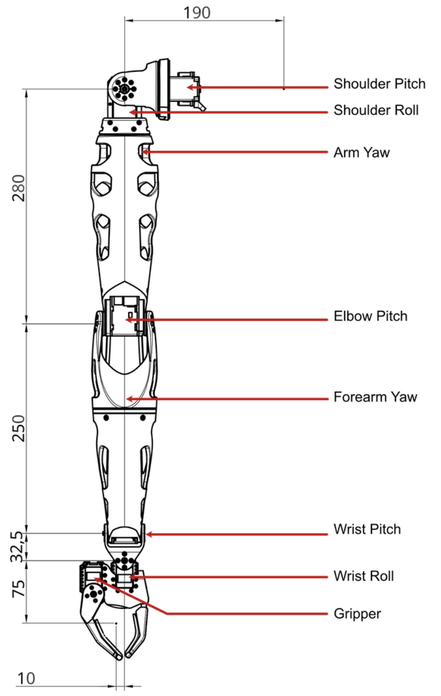
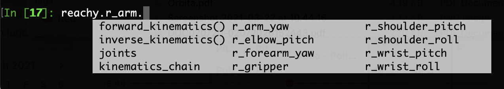
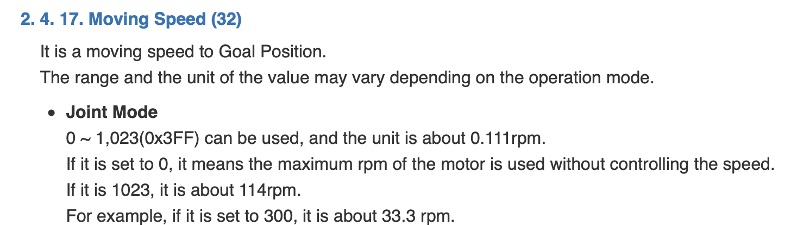
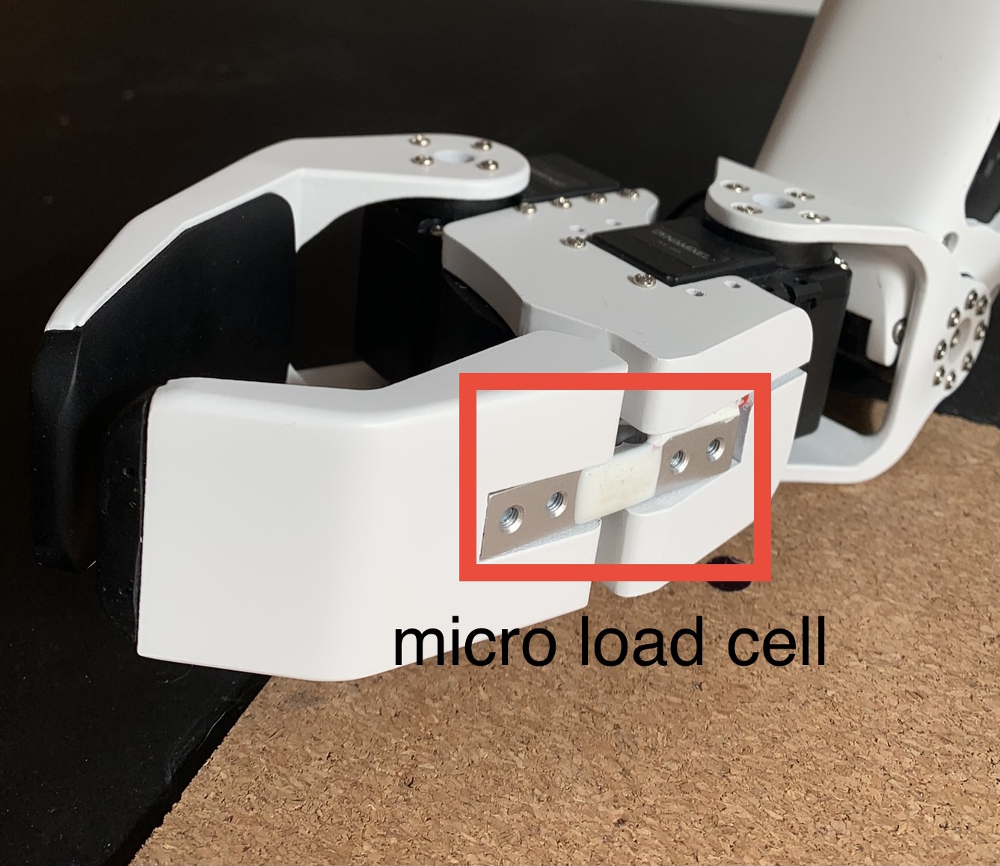
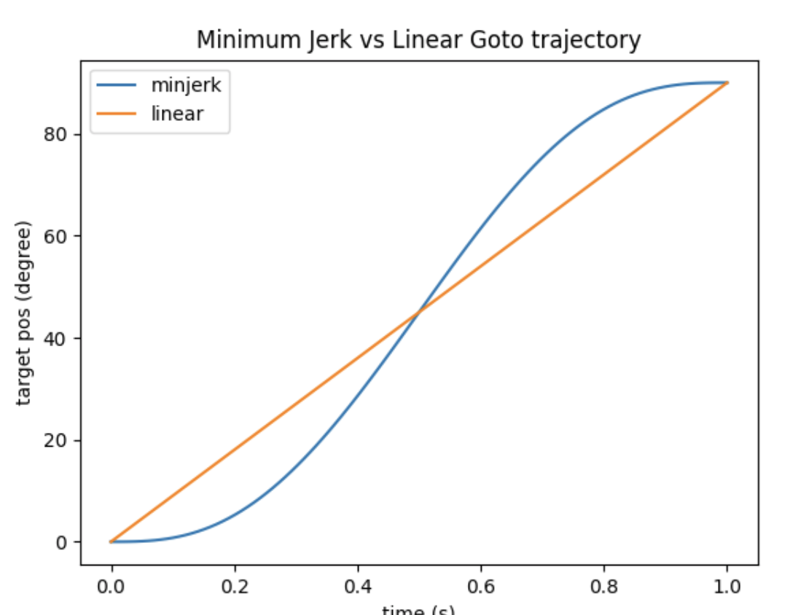
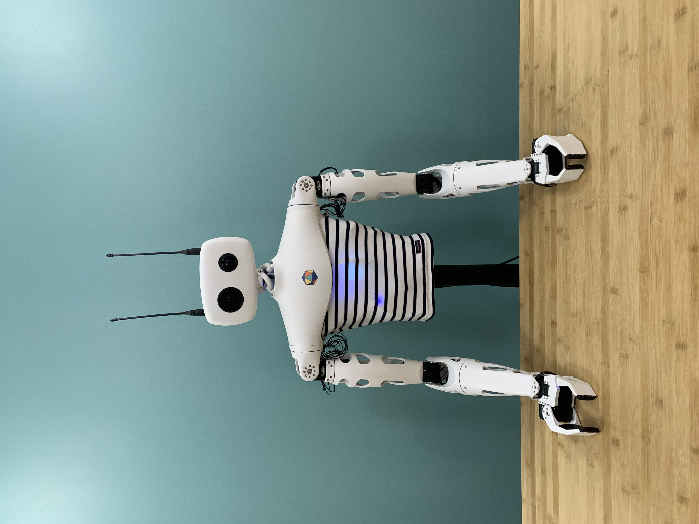

Make sure you checked the [safety page]() before controlling the arm.

This section assumes that you went through the [Hello World]() so that you know how to connect to the robot.

## Arm presentation

Reachy's arm offers 7 degrees of freedom + 1 provided by the gripper and is composed of 8 joints.

The arm's mechanical specifications are given [here]() but as a reminder, the arm schematic is given below:

<p align="center">
  
</p>

### The joints 

Each joint has a unique name and uid. To access a specific joint, you can either use *reachy.joints* which has each joint in the robot as attribute or *reachy.l_arm*/*reachy.r_arm* depending on which arm the joint belongs to of course.

First, connect to your Reachy.

```python
from reachy_sdk import ReachySDK

reachy = ReachySDK(host='192.168.0.42')  # Replace with the actual IP

reachy.joints.r_shoulder_pitch
>>> <Joint name="r_shoulder_pitch" pos="27.98" mode="compliant">
```
The name and the id are attributes of the returned Joint object.

```python 
reachy.r_arm.r_shoulder_pitch.name
>>> 'r_shoulder_pitch'
reachy.r_arm.r_shoulder_pitch.uid
>>> 8
```

> The uid returned by the sdk is different from the id you may have seen in the mechanical specifications. The motor's id in the [mechanical specification]() is the one used at lower level by the dxl bus to communicate with the motors whereas the uid that you see in the sdk is the one used by the different grpc services.

## What information do you have access to?

### From the joints
As explained, each joint composing an arm can be accessed using *reachy.r_arm* for the right arm and *reachy.l_arm* for the left arm.

<p align="center">
  
</p>

All the joints of a given arm can also be accessed simultaneously with the *.joints* attribute.

```python
reachy.r_arm.joints
>>> <Holder
	<Joint name="r_shoulder_pitch" pos="27.98" mode="compliant">
	<Joint name="r_shoulder_roll" pos="-5.51" mode="compliant">
	<Joint name="r_arm_yaw" pos="-6.73" mode="compliant">
	<Joint name="r_elbow_pitch" pos="-71.34" mode="compliant">
	<Joint name="r_forearm_yaw" pos="0.15" mode="compliant">
	<Joint name="r_wrist_pitch" pos="-41.63" mode="compliant">
	<Joint name="r_wrist_roll" pos="-20.38" mode="compliant">
	<Joint name="r_gripper" pos="19.50" mode="compliant">
>
```
This can be useful when you want to recover information like the position or the temperature of multiple arm joints at once.

Beside the joint name and uid there are multiple information which can be obtained from each joint, these are summarized in the *registers()* method.

```python
reachy.r_arm.r_shoulder_pitch.registers()
>>> {'name': 'r_shoulder_pitch',
 'uid': 8,
 'present_position': 22.441230263406165,
 'temperature': 41.0,
 'compliant': True,
 'goal_position': -0.32800019809599856,
 'speed_limit': 0.0,
 'torque_limit': 100.0,
 'pid': (32.0, 0.0, 0.0)}
```

#### present_position

You can get the present position of each joint with this attribute.

```python
reachy.r_arm.r_shoulder_pitch.present_position
>>> 22.4
```
This can be useful in situations such as when you want to record a movement. For example you want to lift an object, you move the arm once yourself, store the present_position of each joint involved and replay it. This is what we used to get the movements in our [Tictactoe application](https://www.youtube.com/watch?v=aGheS4HXEvI)!

Also if you want to teach movements to the robot with learning technics, storing the present_position of the joints will help you build a dataset.

#### temperature

You also have access to each motor temperature with the temperature attribute of each joint. This temperature should be checked to make sure that the robot can operate correctly. The temperature is also monitored internally in Reachy and fans are turned on when the joints are heating.

Check the [safety page]() before controlling the arm for more information.

```python
reachy.r_arm.r_shoulder_pitch.temperature
>>> 41.0
```

#### compliant

As explained in the [previous page](), each motor in Reachy has two compliance modes: **compliant** where the motor is soft and can be freely turned by hand and **stiff** where the motor is hard and can only be moved by setting a target position.

A joint's compliance mode can be easily changed by setting its *compliant* attribute. At startup by default, all joints are compliant.

```python
reachy.r_arm.r_shoulder_pitch.compliant
>>> True
reachy.r_arm.r_shoulder_pitch.compliant = False # stiff mode
reachy.r_arm.r_shoulder_pitch.compliant
>>> False
reachy.r_arm.r_shoulder_pitch.compliant = True # compliant mode
reachy.r_arm.r_shoulder_pitch.compliant
>>> True
```

Because you will often want to turn stiff/compliant all the joints in an arm, in the head or each Reachy's joints, the methods *turn_on()* and *turn_off()* are provided in the SDK.

* **reachy.turn_on(part: str)**: turn all the joints in the requested part in stiff mode,
* **reachy.turn_off(part: str)**: turn all the joints in the requested part in compliant mode.

The *part* argument in these methods can either be **'reachy'**, **'l_arm'**, **'r_arm'** or **'head'**. Using **'reachy'** will turn on/off each joint in Reachy.

```python
reachy.turn_on('r_arm')
```
Check Reachy's right arm after sending this command, if you try to move it with your hands you should feel the resistance applied by the right arm's motors to stay in their position. You can compare with the left arm's motors which should be in compliant mode.

Once you're done using the arm, don't forget to turn it back to compliant mode.

```python
reachy.turn_off('r_arm')
```

> Switching from stiff to compliant for a joint can present a risk of harming Reachy because if the arm was stiff and in the air, it will just fall on what is below him. For example if you have Reachy above a table, place its arm in stiff mode and then in compliant mode, the arm will fall quite hard on the table unless you place your hand below to support the fall.

That is why we also implemented the **turn_off_smoothly** method. With this, we first reduce the torque limit of the joint and then turn it to compliant mode. This result in a smoother transition between the two states.

See the difference below where both Reachy's arms are up and in stiff mode. To put them in compliant mode, we use *turn_off* on the left arm and *turn_off_smoothly* for the right arm.

<video controls="controls" width="75%" autoplay loop>
  <source type="video/mp4" src="compliant.mp4"></source>
  <source type="video/webm" src="orbita.webm"></source>
  <p>Your browser does not support the video element.</p>
</video>

```python
reachy.turn_on('reachy')
reachy.turn_off('l_arm')
reachy.turn_off_smoothly('r_arm')
```

#### goal_position

The *goal_position* attribute of a joint is what is used to set a new joint's target position to make it move. However, we recommend using the [**goto() function**]() to move the motors which provides better control on the joint's trajectories.

#### torque/speed_limit

The torque limit represents the percentage of maximum torque that the motor will use to stay in its present position when it is in stiff mode. We set it to 100% on each joint.

```python
reachy.r_arm.r_shoulder_pitch.torque_limit
>>> 100.0
```

According to the motors documentation, the speed is in rpm (raw per minute).

<p align="center">
  
</p>

source: [https://emanual.robotis.com/docs/en/dxl/ax/ax-18a/#ccw-angle-limit
](https://emanual.robotis.com/docs/en/dxl/ax/ax-18a/#ccw-angle-limit)

We set the speed limit to 0 on each joint, meaning that the motors work at maximum speed.

```python
reachy.r_arm.r_shoulder_pitch.speed_limit
>>> 0.0
```

> **IMPORTANT** We recommend you NOT to change these values. When you want to make movements with Reachy, it's better to replay recorded trajectories or to work with the [**goto() function**]().

#### pid

You can get and set the pid of each joint with the *pid* attribute.

```python
reachy.r_arm.r_shoulder_pitch.pid
>>> (32.0, 0.0, 0.0)
```
If you are familiar with control theory, you'll know what it represents, if not don't worry just ignore it!

### From the force sensor
In the 2023 version of Reachy, only one force sensor is used per arm and it is placed in the gripper to determine if the gripper has an object in it or not.

The force sensor is a 0.78kg micro load cell, it is placed in the arm's gripper as shown below

<p align="center">
  
</p>

The force sensor of each arm is accessible with *reachy.force_sensors*.

```python
reachy.force_sensors
>>> <Holder
	<ForceSensor name="l_force_gripper" force="29.76">
	<ForceSensor name="r_force_gripper" force="-67.72">
>
```

For each force sensor, you can get its name and its force value. 

```python
reachy.force_sensors.l_force_gripper.name
>>> 'l_force_gripper'
reachy.force_sensors.l_force_gripper.force
>>> 29.8
```

The force value measures small deformations of the cell happening when an object is in the gripper. The interesting thing with this is that you can know how much Reachy is squeezing an object and determine a threshold where Reachy holds the object enough to manipulate it without forcing too much on the gripper motor.

## goto() function

### Presentation

This function generates a trajectory between the present position and the goal position. This trajectory is then interpolated at a predefined frequency (100Hz) to compute all intermediary target positions that should be followed before reaching the final goal position. Depending on the interpolation mode chosen, you can have a better control over speed and acceleration.

The two interpolation modes that we use consist in working either linearly or with the minjerk function.

<p align="center">
  
</p>

Both trajectories start and finish at the same point but don't follow the same intermediate positions. The minimum jerk will slowly accelerate at the begining and slowly decelerate at the end. This makes the movements more natural.

The goto() function takes as arguments:

* *goal_positions*: dictionnary whose items are the joints you want to move with their goal positions,
* *duration*: duration in seconds of the trajectory,
* *starting_positions* (optional): dictionary whose items are the joints you want to move with their starting positions. By default it is a dictionary where the keys are the joints requested *goal_positions* with their present position,
* *sampling_freq* (optional): sampling frequency in hz for the trajectory interpolation, 100Hz by default,
* *interpolation_mode*: interpolation mode used to interpolate the trajectory, either [InterpolationMode.LINEAR](https://pollen-robotics.github.io/reachy-sdk/api/trajectory/interpolation.html#reachy_sdk.trajectory.interpolation.InterpolationMode) or [InterpolationMode.MINIMUM_JERK](https://pollen-robotics.github.io/reachy-sdk/api/trajectory/interpolation.html#reachy_sdk.trajectory.interpolation.InterpolationMode).

The function doc is also available [here](https://pollen-robotics.github.io/reachy-sdk/api/trajectory/index.html).

### Example

Let's see an example of how to use it. 

You will use the *goto()* to place the right arm at a right-angled position. First, make sure that the Reachy's right arm is placed on a cleared table and that there will not be obstacles during its movement.

The setup should look like this: 

<p align="center">
  
</p>

Import everything needed to execute the *goto()*:

```python
from reachy_sdk.trajectory import goto
from reachy_sdk.trajectory.interpolation import InterpolationMode
```

Define the dictionary for the right-angled position for the right arm, this will be the *goal_positions* argument of the *goto():

```python
right_angled_position = {
    reachy.r_arm.r_shoulder_pitch: 0,
    reachy.r_arm.r_shoulder_roll: 0,
    reachy.r_arm.r_arm_yaw: 0,
    reachy.r_arm.r_elbow_pitch: -90,
    reachy.r_arm.r_forearm_yaw: 0,
    reachy.r_arm.r_wrist_pitch: 0,
    reachy.r_arm.r_wrist_roll: 0,
}
```

For the *goto()* to work, the right arm's joints need to be in stiff mode.

```python
reachy.turn_on('r_arm')
```

Then the *goto()*, here we use a duration of 1 second with the minimum jerk as interpolation mode but feel free to change it.

```python
goto(
	goal_positions=right_angled_position,
	duration=1.0,
	interpolation_mode=InterpolationMode.MINIMUM_JERK
	)
```

The result should look like this:

<video controls="controls" width="75%" autoplay loop>
  <source type="video/mp4" src="goto.mp4"></source>
  <source type="video/webm" src="orbita.webm"></source>
  <p>Your browser does not support the video element.</p>
</video>

Don't forget to put the right arm's joints back to the compliant mode. Place your hand below the right arm's gripper to prevent the arm from falling hard on the table.

```python
reachy.turn_off('r_arm')
```
