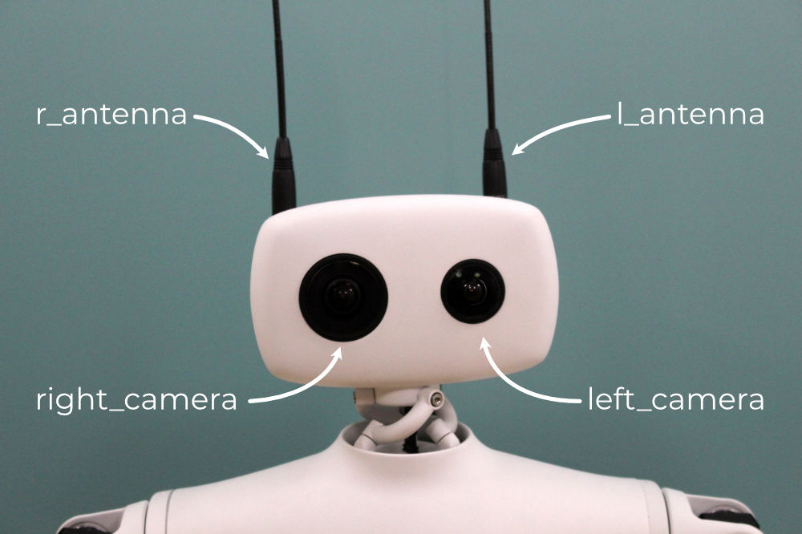

This section assumes that you went through the [Hello World]() so that you know how to connect to the robot.

Reachy 2023 has [two high quality cameras](https://www.kurokesu.com/shop/cameras/C2_USBC) which can deliver up to 1080p at 30 fps. Each camera is equipped with a motorized zoom allowing to adapt the zoom and focus levels to the situation you're working on.

Each camera can be accessed separately with *reachy.left_camera* and *reachy.right_camera*.

First, connect to your Reachy.

```python
from reachy_sdk import ReachySDK

reachy = ReachySDK(host='192.168.0.42')  # Replace with the actual IP

reachy.left_camera
>>> <Camera side="left" resolution=(720, 1280, 3)>
```

The left and right sides are considered from Reachy point of view.

<p align="center">
  
</p>

## Get the images

The last image captured by each camera can be obtained with the *.last_frame* attribute.

```python
import cv2 as cv

img = reachy.right_camera.last_frame

cv.imshow('right_frame', img)
cv.waitKey(0)
cv.destroyAllWindows()
```

## Video stream

### If you are directly working on Reachy

You can visualize the video feed from both cameras easily with a [python script](https://github.com/pollen-robotics/reachy_controllers/blob/master/examples/view_cam.py) made for that.

If reachy_sdk_server, the ROS2 server for Reachy SDK, is running.

In a terminal:
```bash
$ python3 ~/reachy_ws/src/reachy_2023/camera_controllers/examples/view_cam.py "camera_you_want" ros
```
For example, if you want to visualize the left camera:
```bash
$ python3 ~/reachy_ws/src/reachy_2023/camera_controllers/examples/view_cam.py left ros
```

If reachy_sdk_server is not running, you can work with opencv.
```bash
$ python3 ~/reachy_ws/src/reachy_2023/camera_controllers/examples/view_cam.py left opencv
```

> NOTE: This will only work if you are working directly on the robot with a computer screen plugged to it and not remotely.

### If you are working remotely

You can also visualize the video feed from any computer, considering it is on the same network as Reachy and that you know Reachy's IP address.

To view the left camera:
```bash
cd ~/reachy-sdk/reachy_sdk/examples
python3 view_cam_sdk.py left --ip_address '192.168.0.42'  # Replace with the actual IP
```

## Control the motorized zoom

The piloting of Reachy's zooms is using *zoom_kurokesu*, a custom [python library](https://github.com/pollen-robotics/zoom_kurokesu).

### Zoom level

There are three zoom levels available: 'in', 'out', 'inter'.
* 'in': for close objects,
* 'out': for further objects,
* 'inter': in between the 'in' and 'out' positions.

The zoom levels have been selected so that if you set the same zoom level on both cameras, you should see the same image (slightly shifted of course considering the cameras are few centimeters from each other).

The current zoom level applied to a camera can be checked.

```python
reachy.left_camera.zoom_level
>>> <ZoomLevel.INTER: 2>

reachy.right_camera.zoom_level
>>> <ZoomLevel.INTER: 2>
```

The zoom level can be set with *ZoomLevel* from *reachy_sdk.camera*.

```python
from reachy_sdk.camera import ZoomLevel

reachy.left_camera.zoom_level = ZoomLevel.OUT
reachy.right_camera.zoom_level = ZoomLevel.IN
```

You should hear the Reachy's zooms motors moving.

Each zoom level sends positions instructions relatively to a base position and it may happen that the base positions get a bit drifted. The homing instruction bring the zoom motors to their limit and reset the base positions from it.

```python
reachy.right_camera.zoom_homing()
```

Once the homing executed, you can reset a zoom position.

```python
reachy.left_camera.zoom_level = ZoomLevel.INTER
```

### Autofocus

Changing the zoom level does not adapt the focus directly. However, autofocus is available!
To use it: 
```python
reachy.left_camera.start_autofocus()
```

>NOTE: the autofocus algorithm will not focus on one specific area of the image, it will try to give the clearest image overall.


### Zoom speed

The speed of the zoom motors can also be changed along with the level.

The value of the speed is an int between 4000 and 40000, by default the value is at 10000 but you can change it easily.

```python
reachy.left_camera.zoom_speed
>>> 10000

reachy.left_camera.zoom_speed = 30000

reachy.left_camera.zoom_speed
>>> 30000
```