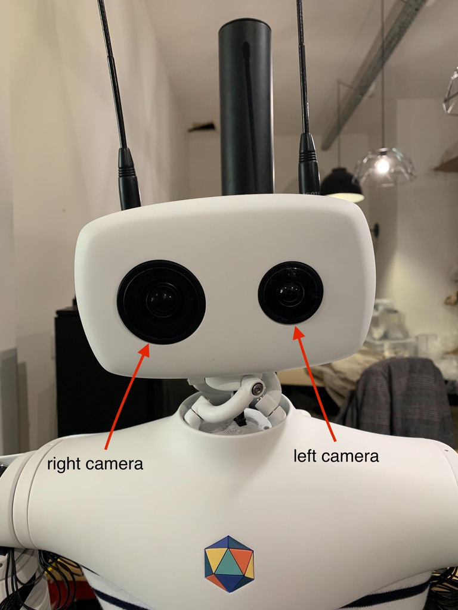

This section assumes that you went through the [Hello World](http://localhost:1313/reachy-2021-docs/sdk/getting-started/hello-world/) so that you know how to connect to the robot.

Reachy 2021 has [two high quality cameras](https://www.kurokesu.com/shop/featured/CAMERA_C1_PRO) which can deliver up to 1080p at 30 fps. Each camera is equipped with a motorized zoom allowing to adapt the zoom level to the situation you're working on.

Each camera can be accessed separately with *reachy.left_camera* and *reachy.right_camera*.

First, connect to your Reachy.

```python
from reachy_sdk import ReachySDK

reachy = ReachySDK(host='192.168.0.42')  # Replace with the actual IP

reachy.left_camera
>>> <Camera side="left" resolution=(720, 1280, 3)>
```

The left and right sides are considered from Reachy point of view.

<p align="center">
  
</p>

## Get the images

The last image captured by each camera can be obtained with the *.last_frame* attribute.

```python
import cv2 as cv

img = reachy.right_camera.last_frame

cv.imshow('right_frame', img)
cv.waitKey(0)
cv.destroyAllWindows()
```

## Control the motorized zoom

The piloting of Reachy's zooms is working with, *zoom_kurokesu*, a custom [python library](https://github.com/pollen-robotics/zoom_kurokesu).

### Zoom level

There are three zoom levels available: 'in', 'out', 'inter'.
* 'in': for close objects,
* 'out': for further objects,
* 'inter': in between the 'in' and 'out' positions.

The zoom levels have been selected so that if you set the same zoom level on both cameras, you should see the same image (slightly shifted of course considering the cameras are few centimeters from each other).

The current zoom level applied to a camera can be checked.

```python
reachy.left_camera.zoom_level
>>> <ZoomLevel.INTER: 2>

reachy.right_camera.zoom_level
>>> <ZoomLevel.INTER: 2>
```

The zoom level can be set with *ZoomLevel* from *reachy_sdk.camera*.

```python
from reachy_sdk.camera import ZoomLevel

reachy.left_camera.zoom_level = ZoomLevel.OUT
reachy.right_camera.zoom_level = ZoomLevel.IN
```

You should hear the Reachy's zooms motors moving.

Getting the last frame from each camera, you should see the different zoom levels have been applied.

If when using the zooms you get images blurrier that what they are supposed to be, use the *homing* command.
Each zoom level sends positions instructions relatively to a base position and it can happen that the base positions get a bit drifted. The homing instruction bring the zoom motors to their limit and re set the base positions from it.

```python
reachy.right_camera.zoom_homing()
```

Once the homing executed, you can re set a zoom position.

```python
reachy.left_camera.zoom_level = ZoomLevel.INTER
```

### Zoom speed

The speed of the zoom motors can also be changed along with the level.

The value of the speed is an int between 4000 and 40000, by default the value is at 10000 but you can chage it easily.

```python
reachy.left_camera.zoom_speed
>>> 10000

reachy.left_camera.zoom_speed = 30000

reachy.left_camera.zoom_speed
>>> 30000
```