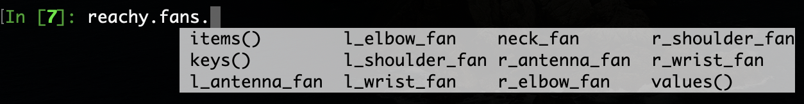
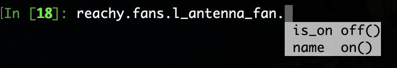

This section assumes that you went through the [Hello World]() so that you know how to connect to the robot.

Reachy is equipped with fans to cooldown the joints when they are working. Each arm has three fans, two fans are in the head and one fan is placed below orbita (Reachy's neck).

First, connect to your Reachy.

```python
from reachy_sdk import ReachySDK

reachy = ReachySDK(host='192.168.0.42')  # Replace with the actual IP

reachy.fans
>>> <Holder
	<Fan name="l_shoulder_fan" state="off">
	<Fan name="l_elbow_fan" state="off">
	<Fan name="l_wrist_fan" state="off">
	<Fan name="r_shoulder_fan" state="off">
	<Fan name="r_elbow_fan" state="off">
	<Fan name="r_wrist_fan" state="off">
	<Fan name="l_antenna_fan" state="off">
	<Fan name="r_antenna_fan" state="off">
>
```

As explained in the [safety page](), the temperature of each joint is controlled internally in Reachy and if it reaches a certain value, the corresponding fan turns on. 
However, you might want to turn them on sooner so that the joints work longer on a demanding task.

The *reachy.fans* object contains each fan. You can have access to each fan individually or to all at once.

<p align="center">
  
</p>

```python
for fan in reachy.fans.values():
  print(fan)
>>> <Fan name="l_shoulder_fan" state="off">
<Fan name="l_elbow_fan" state="off">
<Fan name="l_wrist_fan" state="off">
<Fan name="r_shoulder_fan" state="off">
<Fan name="r_elbow_fan" state="off">
<Fan name="r_wrist_fan" state="off">
<Fan name="l_antenna_fan" state="off">
<Fan name="r_antenna_fan" state="off">
```
Each *Fan* object has two attributes: 
* *name* string with the fan's name, 
* *is_on* boolean, False when the fan is off and True when it is on.
and two methods:
* *on()* which turns the fan on,
* *off()* which turns the fan off.

<p align="center">
  
</p>

Thus you can easily turn on a fan.

```python
reachy.fans.r_wrist_fan.on()

reachy.fans.r_wrist_fan.is_on
>>> True

reachy.fans.r_wrist_fan.off()
```

> IMPORTANT: Even though the *.on()* and *.off()* methods seem available for the *neck_fan*, using them will not work. The *neck_fan* will only been turned on automatically when its temperature reaches the activation threshold.
