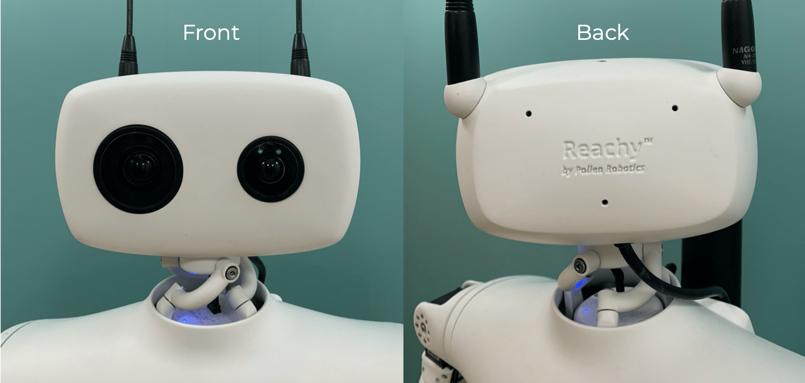
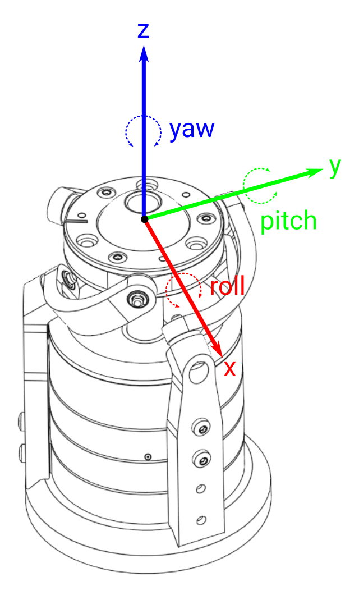

Make sure you checked the [safety page]() before controling the arm.

This section assumes that you went through the [Hello World]() so that you know how to connect to the robot.

## Head presentation

Reachy's head is composed of three parts:
* a front side where two cameras equipped with motorized zoom are attached,
* a back side equiped with two antennas to convey emotions along with two fans in the inner part to cool down the components inside the head,
* a neck ball joint, thanks to our Orbita actuator.  

<video controls="controls" width="75%" autoplay loop>
  <source type="video/mp4" src="orbita.mp4"></source>
  <source type="video/webm" src="orbita.webm"></source>
  <p>Your browser does not support the video element.</p>
</video>

The complete head's specifications are given [here]().

### Front and back

Below you can see Reachy's head front and back supported by the Orbita actuator.

<p align="center">
  
</p>

### Reachy's neck: Orbita actuator

The Orbita actuator is a unique technology developed by Pollen Robotics’ R&D team. This ball joint actuator allows unpreceded dynamic and multi-directional movement. This joint is used as the neck of Reachy and permits to mimic the degrees of freedom of the human neck. With this, the experience of controling Reachy with Virtual Reality gets even more immersive.

Orbita can be controlled as a 3D rotation.

<p align="center">
  
</p>

We wrote a [Medium article on Orbita](https://medium.com/pollen-robotics/orbita-is-turning-heads-literally-d10d378550e2) to explain how it works and what inspired us to create it. If you have 10 minutes, go check it out!

## Controling each part

Before starting to control it, connect to your Reachy. As in the other pages:

```python
from reachy_sdk import ReachySDK

reachy = ReachySDK(host='192.168.0.42')  # Replace with the actual IP

reachy.head
>>> <Head joints=<Holder
	<Joint name="l_antenna" pos="121.26" mode="compliant">
	<Joint name="r_antenna" pos="-10.70" mode="compliant">
	<Joint name="neck_roll" pos="9.16" mode="compliant">
	<Joint name="neck_pitch" pos="-6.09" mode="compliant">
	<Joint name="neck_yaw" pos="-14.92" mode="compliant">
>>
```

The *reachy.head* object has five joints: one for each Orbita's disks (three in total) and one per antenna. All the joints in Reachy's head are in the *reachy.head.joints* object and each joint being an attribute of *reachy.head*, they can also be accessed individually.

```python
reachy.head.joints
>>> <Holder
	<Joint name="l_antenna" pos="-2.49" mode="stiff">
	<Joint name="r_antenna" pos="-0.44" mode="stiff">
	<Joint name="neck_roll" pos="-5.72" mode="stiff">
	<Joint name="neck_pitch" pos="-19.77" mode="stiff">
	<Joint name="neck_yaw" pos="-54.11" mode="stiff">
>
```

### Orbita: look_at method

Each motor in Orbita can be controlled individually, but having the head doing the movements you desire using this will be very hard as it involves mathematical transformation with the use of quaternions.

To make things simpler, we implemented the *look_at* method which hides all the maths.

With this, instead of piloting each disk individually you can specify a point in the space at which the head will look.

The coordinates of the specified point are expressed in Reachy's coordinates system, as presented in the [Kinematics page](). 

Fox example, if you want Reachy to look forward you can send it the following.

```python
reachy.turn_on('head') # Don't forget to put the hand in stiff mode
reachy.head.look_at(x=0.5, y=0, z=0, duration=1.0)
```

> Remember that the coordinates in Reachy's coordinates system are in meters.

You can use multiple *look_at* to chain head movements.

<video controls="controls" width="75%" autoplay loop>
  <source type="video/mp4" src="look.mp4"></source>
  <source type="video/webm" src="look.webm"></source>
  <p>Your browser does not support the video element.</p>
</video>

Here is the code to reproduce this.

```python
import time

look_right = reachy.head.look_at(x=0.5, y=-0.5, z=0.1, duration=1.0)
time.sleep(0.1)
look_down = reachy.head.look_at(x=0.5, y=0, z=-0.4, duration=1.0)
time.sleep(0.1)
look_left = reachy.head.look_at(x=0.5, y=0.3, z=-0.3, duration=1.0)
time.sleep(0.1)
look_front = reachy.head.look_at(x=0.5, y=0, z=0, duration=1.0)
```

The best way to understand how to use the *look_at* is to play with it. Picture a position you would like Reachy's head to be in, guess a point which could match for the *look_at* and check if you got it right!

And don't forget to put the head back to compliant mode to protect the motors, once you're done using them.

```python
reachy.turn_off('head')
```

Another cool thing is that we can combine Reachy's kinematics with the *look_at* so that Reachy's head follows its hand!

<video controls="controls" width="75%" autoplay loop>
  <source type="video/mp4" src="look_at_hand.mp4"></source>
  <source type="video/webm" src="look_at_hand.webm"></source>
  <p>Your browser does not support the video element.</p>
</video>

```python
reachy.turn_on('head')

x, y, z = reachy.r_arm.forward_kinematics()[:3, -1]
reachy.head.look_at(x=x, y=y, z=z, duration=1.0)

time.sleep(0.5)

while True:
    x, y, z = reachy.r_arm.forward_kinematics()[:3, -1]
    reachy.head.look_at(x=x, y=y, z=z, duration=0.1)
```

What the code says is that we compute the [forward kinematics of Reachy's right arm](), and the x, y, z of Reachy's right end-effector in the Reachy's coordinates system will be the coordinates of the point used by the *look_at*.

### Cameras

The dedicated page on Reachy's cameras can be found [here]().

### Antennas

The antennas can be controlled like any other joint in Reachy. You can turn the motors stiff/compliant, get the present position, the temperature, set a goal position, ... 
For more details on the attributes of a Reachy's joint, go to the [joints section of 'Controling the arm']() page. 

The antennas are a powerful tool to convey emotions to Reachy. For example just by moving the antennas, you can tell whether Reachy is happy or not.

```python
def happy_antennas():
    reachy.head.l_antenna.speed_limit = 0.0
    reachy.head.r_antenna.speed_limit = 0.0
    
    for _ in range(9):
        reachy.head.l_antenna.goal_position = 10.0
        reachy.head.r_antenna.goal_position = -10.0

        time.sleep(0.1)

        reachy.head.l_antenna.goal_position = -10.0
        reachy.head.r_antenna.goal_position = 10.0

        time.sleep(0.1)
    
    reachy.head.l_antenna.goal_position = 0.0
    reachy.head.r_antenna.goal_position = 0.0
        
def sad_antennas():
    reachy.head.l_antenna.speed_limit = 70.0
    reachy.head.r_antenna.speed_limit = 70.0
    
    reachy.head.l_antenna.goal_position = 140.0
    reachy.head.r_antenna.goal_position = -140.0
    
    time.sleep(5.0)
    
    reachy.head.l_antenna.goal_position = 0.0
    reachy.head.r_antenna.goal_position = 0.0

happy_antennas()
sad_antennas()
```

The result should look like the following.

<video controls="controls" width="75%" autoplay loop>
  <source type="video/mp4" src="antennas.mp4"></source>
  <source type="video/webm" src="antennas.webm"></source>
  <p>Your browser does not support the video element.</p>
</video>

Combining this with head movements amplifies the emotions transmitted. Having Reachy lowering its head makes it even sadder...

```python
reachy.head.look_at(0.5, 0, -0.4, 1.0)
sad_antennas()
reachy.head.look_at(0.5, 0, -0.0, 1.0)
```

<video controls="controls" width="75%" autoplay loop>
  <source type="video/mp4" src="sad.mp4"></source>
  <source type="video/webm" src="sad.webm"></source>
  <p>Your browser does not support the video element.</p>
</video>

Use your imagination to combine antennas and head movements and create new emotions for Reachy!

### Fans

The two fans inside Reachy's head can also be controlled as any other fan in Reachy. The dedicated page on fan controling can be found [here]().
