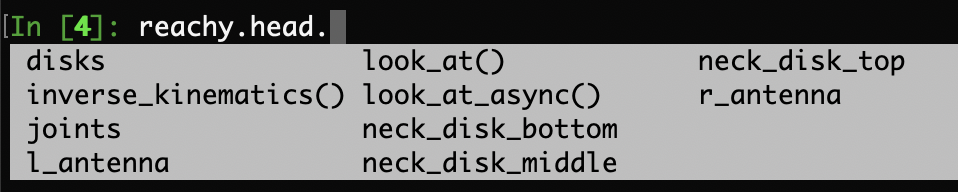

Make sure you checked the [safety page](https://pollen-robotics.github.io/reachy-2021-docs/sdk/first-moves/safety/) before controling the arm.

This section assumes that you went through the [Hello World](http://localhost:1313/reachy-2021-docs/sdk/getting-started/hello-world/) so that you know how to connect to the robot.

## Head presentation

Reachy's head is composed of three parts:
* a front side where two cameras equipped with motorized zoom are attached,
* a back side equiped with two antennas to convey emotions along with two fans in the inner part to cool down the components inside the head,
* a neck ball joint, thanks to our Orbita actuator.  

<p align="center">
  
</p>

The complete head's specifications are given [here](http://localhost:1313/reachy-2021-docs/docs/specifications/head-specs/).

### Front and back

Below you can see Reachy's head front and back along supported by the Orbita actuator.

TODO: Put image with front and back.

### Reachy's neck: Orbita actuator

The Orbita actuator is a unique technology developed by Pollen Robotics’ R&D team. This ball joint actuator allows unpreceded dynamic and multi-directional movement. This joint is the neck of Reachy and permits to mimic the degrees of freedom of the human neck. With this, the experience of controling Reachy with Virtual Reality gets even more immersive.

Orbita is composed of three disks named *top*, *middle* and *bottom* which can be piloted individually.

<p align="center">
  
</p>

We wrote a [Medium article on Orbita](https://medium.com/pollen-robotics/orbita-is-turning-heads-literally-d10d378550e2) to explain how it works and what aspired us to create it. If you have 10 minutes, go check it out!

## Controling each part

Before starting to control it, connect to your Reachy. As in the other pages:

```python
from reachy_sdk import ReachySDK

reachy = ReachySDK(host='192.168.0.42')  # Replace with the actual IP

reachy.head
>>> <Head joints=<Holder
	<Joint name="l_antenna" pos="121.26" mode="compliant">
	<Joint name="r_antenna" pos="-10.70" mode="compliant">
	<Joint name="neck_disk_top" pos="-49.16" mode="compliant">
	<Joint name="neck_disk_middle" pos="-61.09" mode="compliant">
	<Joint name="neck_disk_bottom" pos="-54.92" mode="compliant">
>>
```

The *reachy.head* object has five joints: one for each Orbita's disks (three in total) and one per antenna. All the joints in Reachy's head are in the *reachy.head.joints* object and each joint being an attribute of *reachy.head*, they can also be accessed individually.

```python
reachy.head.joints
>>> <Holder
	<Joint name="l_antenna" pos="-2.49" mode="stiff">
	<Joint name="r_antenna" pos="-0.44" mode="stiff">
	<Joint name="neck_disk_top" pos="-54.72" mode="stiff">
	<Joint name="neck_disk_middle" pos="-69.77" mode="stiff">
	<Joint name="neck_disk_bottom" pos="-54.11" mode="stiff">
>
```

<p align="center">
  
</p>

### Orbita: look_at method

Each motor in Orbita can be controlled individually but having the head doing the movements you desire using this will be very hard as it involves mathematical transformation with the use of quaternions.

To make things simpler, we implemented the *look_at* method which hides all the maths.

With this, instead of piloting each disk individually you can specify a point in the space at which the head will look.

For example, consider that the following situation. Reachy is looking straight forward and you want it to look at the TicTacToe board. To do that, Reachy will have to put its head down. 
So you can picture a point in Reachy's workspace and tell it: "Look at this point".

**TODO: photo situation**

To know the point coordinates you should send, you need to know Reachy's coordinates system. It it the same as the one used in [Reachy's kinematics model](http://localhost:1313/reachy-2021-docs/sdk/first-moves/kinematics/#kinematic-model).

The *look_at* method can be used to achieve this. 


### Cameras

The dedicated page on Reachy's cameras can be found [here](http://localhost:1313/reachy-2021-docs/sdk/first-moves/cameras/).

### Antennas

The antennas can be controlled like any other joint in Reachy. You can turn the motors stiff/compliant, get the present position, the temperature, set a goal position, ... 
For more details on the attributes of a Reachy's joint, go to the [joints section of 'Controling the arm'](http://localhost:1313/reachy-2021-docs/sdk/first-moves/arm/#from-the-joints) page. 


For example, we can shake Reachy's antennas to make it seem like it is happy.

```python
import numpy as np
import time

duration = 1
t = np.linspace(0, duration, duration * 100)
pos = np.rad2deg(np.sin(2 * np.pi * 5 * t))

for p in pos:
    reachy.head.l_antenna.goal_position = p
    reachy.head.r_antenna.goal_position = -p
    time.sleep(0.03)
```

The result should look like the following.

TODO: add gif

### Fans

The two fans inside Reachy's head can also be controlled as any other fan in Reachy. The dedicated page on fan controling can be found [here](http://localhost:1313/reachy-2021-docs/sdk/first-moves/fans/).
