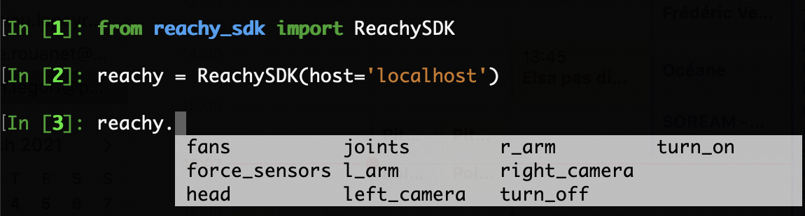

If you followed the instructions from ["Finding Reachy's IP"](), you know how to get Reachy's IP address and how to connect to the robot with the command: 

```python
from reachy_sdk import ReachySDK

reachy = ReachySDK(host='192.168.0.42')  # Replace with the actual IP
```

## The reachy object

The *reachy* object instanciated above is the main tool to access the information coming from Reachy's sensors (joints, force sensors, cameras) and to control each part of the robot (left/right arm, head).

### reachy's attributes

The reachy object has 8 attributes and 2 methods that we will quickly present here, more detailed information are given in the dedicated pages after this one. 



### reachy.fans

[DeviceHolder object](https://pollen-robotics.github.io/reachy-sdk/api/device_holder.html). We made the DeviceHolder class to have an object that can contain all sensors of the same type (eg. Fan, ForceSensor, Joint). The goal was to not overcrowd the ReachySDK class with all devices.

Here, *reachy.fans* contains all the fans in Reachy. Each fan can then be accessed individually or you can get and set all the fan states at once.

```python
reachy.fans
>>> <Holder
	<Fan name="l_shoulder_fan" state="off">
	<Fan name="l_elbow_fan" state="off">
	<Fan name="l_wrist_fan" state="off">
	<Fan name="r_shoulder_fan" state="off">
	<Fan name="r_elbow_fan" state="off">
	<Fan name="r_wrist_fan" state="off">
	<Fan name="l_antenna_fan" state="off">
	<Fan name="r_antenna_fan" state="off">
>
```

### reachy.force_sensors

[DeviceHolder object](https://pollen-robotics.github.io/reachy-sdk/api/device_holder.html) containing all the force sensors in Reachy. In the 2021 Reachy version there are only two force sensors, one in the gripper of each arm. As with the fans, each force sensor can be accessed individually or all at once.

```python
reachy.force_sensors
>>> <Holder
	<ForceSensor name="l_force_gripper" force="31.30">
	<ForceSensor name="r_force_gripper" force="-67.02">
>
```

### reachy.head

[Head object](https://pollen-robotics.github.io/reachy-sdk/api/head.html).
Contains the three joints composing the Orbita actuator along with methods for its kinematics or to control it.

```python
reachy.head
>>> <Head joints=<Holder
	<Joint name="neck_roll" pos="0.00" mode="compliant">
	<Joint name="neck_pitch" pos="0.00" mode="compliant">
	<Joint name="neck_yaw" pos="0.00" mode="compliant">
	<Joint name="l_antenna" pos="0.00" mode="compliant">
	<Joint name="r_antenna" pos="0.00" mode="compliant">
>>
```

### reachy.joints

[Joint object](https://pollen-robotics.github.io/reachy-sdk/api/joint.html) containing every joint of the robot, from its arms to its head and antennas. This is useful when you want to get information, like the position, from all joints at once.

```python
reachy.joints
>>> <Holder
	<Joint name="l_shoulder_pitch" pos="-0.86" mode="compliant">
	<Joint name="l_shoulder_roll" pos="-0.38" mode="compliant">
	<Joint name="l_arm_yaw" pos="-81.45" mode="compliant">
	<Joint name="l_elbow_pitch" pos="-51.38" mode="compliant">
	<Joint name="l_forearm_yaw" pos="-16.28" mode="compliant">
	<Joint name="l_wrist_pitch" pos="-41.10" mode="compliant">
	<Joint name="l_wrist_roll" pos="-21.26" mode="compliant">
	<Joint name="l_gripper" pos="-3.08" mode="compliant">
	<Joint name="r_shoulder_pitch" pos="29.65" mode="compliant">
	<Joint name="r_shoulder_roll" pos="-0.94" mode="compliant">
	<Joint name="r_arm_yaw" pos="-7.60" mode="compliant">
	<Joint name="r_elbow_pitch" pos="-71.78" mode="compliant">
	<Joint name="r_forearm_yaw" pos="-0.73" mode="compliant">
	<Joint name="r_wrist_pitch" pos="-43.03" mode="compliant">
	<Joint name="r_wrist_roll" pos="-37.10" mode="compliant">
	<Joint name="r_gripper" pos="19.50" mode="compliant">
	<Joint name="l_antenna" pos="140.32" mode="compliant">
	<Joint name="r_antenna" pos="79.03" mode="compliant">
	<Joint name="neck_roll" pos="-21.58" mode="compliant">
	<Joint name="neck_pitch" pos="-79.71" mode="compliant">
	<Joint name="neck_yaw" pos="-59.27" mode="compliant">
>
```

### reachy.l_arm

[Arm object](https://pollen-robotics.github.io/reachy-sdk/api/arm.html) containing every joint in the left arm along with its kinematics methods.

```python
reachy.l_arm
>>> <Arm side="left" joints=<Holder
	<Joint name="l_shoulder_pitch" pos="-0.86" mode="compliant">
	<Joint name="l_shoulder_roll" pos="-0.38" mode="compliant">
	<Joint name="l_arm_yaw" pos="-81.45" mode="compliant">
	<Joint name="l_elbow_pitch" pos="-51.38" mode="compliant">
	<Joint name="l_forearm_yaw" pos="-16.28" mode="compliant">
	<Joint name="l_wrist_pitch" pos="-41.10" mode="compliant">
	<Joint name="l_wrist_roll" pos="-21.26" mode="compliant">
	<Joint name="l_gripper" pos="-3.08" mode="compliant">
>>
```

### reachy.left_camera

[Camera object](https://pollen-robotics.github.io/reachy-sdk/api/camera.html). It is used to recover the last image captured by the left camera and also to control the motorized zoom attached to the camera.

```python
reachy.left_camera
>>> <Camera side="left" resolution=(720, 1280, 3)>
```

### reachy.r_arm

[Arm object](https://pollen-robotics.github.io/reachy-sdk/api/arm.html) containing every joint in the right arm along with its kinematics methods.

```python
reachy.r_arm
>>> <Arm side="right" joints=<Holder
	<Joint name="r_shoulder_pitch" pos="29.65" mode="compliant">
	<Joint name="r_shoulder_roll" pos="-0.94" mode="compliant">
	<Joint name="r_arm_yaw" pos="-7.60" mode="compliant">
	<Joint name="r_elbow_pitch" pos="-71.78" mode="compliant">
	<Joint name="r_forearm_yaw" pos="-0.73" mode="compliant">
	<Joint name="r_wrist_pitch" pos="-43.03" mode="compliant">
	<Joint name="r_wrist_roll" pos="-37.10" mode="compliant">
	<Joint name="r_gripper" pos="19.50" mode="compliant">
>>
```

### reachy.right_camera

[Camera object](https://pollen-robotics.github.io/reachy-sdk/api/camera.html). It is used to recover the last image captured by the right camera and also to control the motorized zoom attached to the camera.

```python
reachy.right_camera
>>> <Camera side="right" resolution=(720, 1280, 3)>
```

### reachy.turn_on()

Method to turn on the specified Reachy's parts (either left/right arm, head or even all at once). Turning on a part means putting all the joints in this part in stiff mode. See next section for more information on what the stiff mode is for a motor.

```python
reachy.turn_on('reachy')
```
Using *'reachy'* as argument turns on all the parts in Reachy.

### reachy.turn_off()

Method to turn off the specified Reachy's parts (either left/right arm, head or even all at once). Turning off a part means putting all the joints in this part in compliant mode. See next section for more information on what the compliant mode is for a motor.

```python
reachy.turn_off('reachy')
```