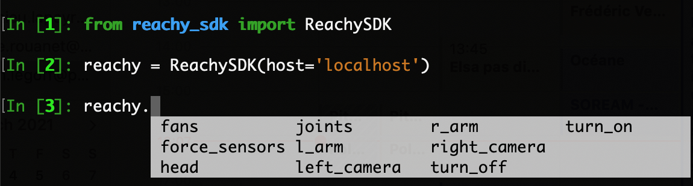

If you followed the instructions from ["Finding Reachy's IP"](http://localhost:1313/reachy-2021-docs/sdk/getting-started/finding-ip/), you know how to get Reachy's IP address and how to connect to the robot with the command: 

```python
from reachy_sdk import ReachySDK

reachy = ReachySDK(host='192.168.0.42')  # Replace with the actual IP
```

## The reachy object

The *reachy* object instanciated above is the main tool to acces to the information coming from Reachy's sensors (joints, force sensors, cameras) and to control each part of the robot (left/right arm, head).

### reachy's attributes

The reachy object has 8 attributes and 2 method that we will quickly present here, more detailed information are given in the dedicated pages after this one. 



### reachy.fans

[DeviceHolder object](https://pollen-robotics.github.io/reachy-sdk/api/device_holder.html). We made the DeviceHolder class to have an object that can contain all sensors of the same type (eg. Fan, ForceSensor, Joint). the goal was to not overcrowd the ReachySDK class with all devices.

Here, *reachy.fans* contains all the fans in Reachy. Each fan can then be accessed individually or you can get and set all the fan states at once.

```python
reachy.fans
>>> <Holder
	<Fan name="l_shoulder_fan" state="off">
	<Fan name="l_elbow_fan" state="off">
	<Fan name="l_wrist_fan" state="off">
	<Fan name="r_shoulder_fan" state="off">
	<Fan name="r_elbow_fan" state="off">
	<Fan name="r_wrist_fan" state="off">
	<Fan name="neck_fan" state="off">
	<Fan name="l_antenna_fan" state="off">
	<Fan name="r_antenna_fan" state="off">
>
```

### reachy.force_sensors

[DeviceHolder object](https://pollen-robotics.github.io/reachy-sdk/api/device_holder.html) containing all the force sensors in Reachy. In the 2021 Reachy version there are only two force sensors, one in the gripper of each arm. As with the fans, each force sensor can be accessed individually or all at once.

```python
reachy.force_sensors
>>> <Holder
	<ForceSensor name="l_force_gripper" force="31.30">
	<ForceSensor name="r_force_gripper" force="-67.02">
>
```

### reachy.head

[Head object](https://pollen-robotics.github.io/reachy-sdk/api/head.html).
Contains the three joints composing the Orbita actuator along with methods for its kinematics or to control it.

```python
reachy.head
>>> <Head joints=<Holder
	<Joint name="neck_disk_top" pos="-21.58" mode="compliant">
	<Joint name="neck_disk_middle" pos="-79.71" mode="compliant">
	<Joint name="neck_disk_bottom" pos="-59.27" mode="compliant">
>>
```

### reachy.joints

```python

>>>
```

### reachy.l_arm

```python

>>>
```

### reachy.left_camera

```python

>>>
```

### reachy.r_arm

```python

>>>
```

### reachy.right_camera

```python

>>>
```

### reachy.turn_on()

Method to turn on the specified Reachy's parts (either left/right arm, head or even all at once). Turning on the means putting all the joints in the part in stiff mode. See next section for more information on what the stiff mode is for a motor.

```python
reachy.turn_on('reachy')
```
Using *'reachy'* as argument turns on all the parts in Reachy.

### reachy.turn_off()

Method to turn off the specified Reachy's parts (either left/right arm, head or even all at once). Turning off the means putting all the joints in the part in compliant mode. See next section for more information on what the compliant mode is for a motor.

```python
reachy.turn_off('reachy')
```