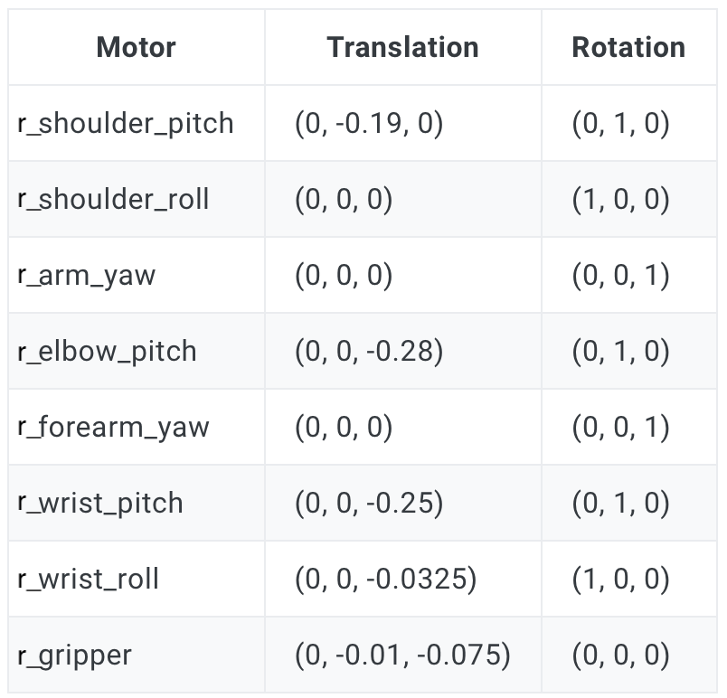
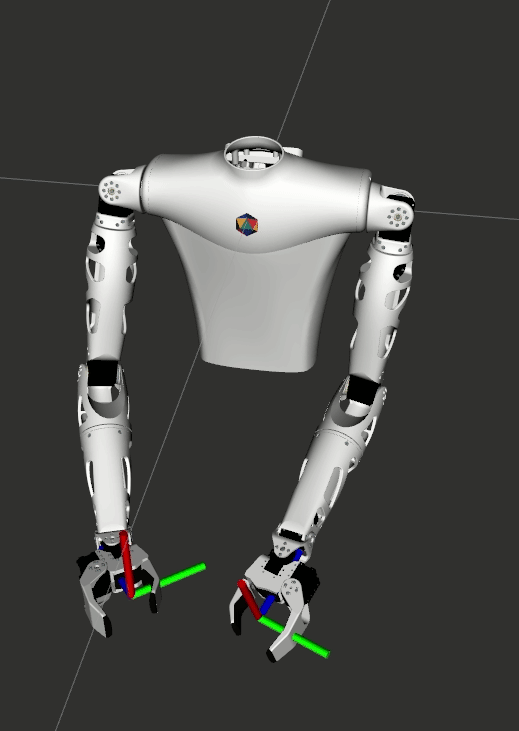

Make sure you checked the [safety page](http://localhost:1313/reachy-2021-docs/sdk/first-moves/safety/) before controling the arm.

This section assumes that you went through the [Hello World](http://localhost:1313/reachy-2021-docs/sdk/getting-started/hello-world/) so that you know how to connect to the robot and that you also know how to use the *goto()* function presented in [Controling the arm](http://localhost:1313/reachy-2021-docs/sdk/first-moves/arm/).

## Arm coordinate system

### Joint coordinates

If you remember the [*goto()* function](http://localhost:1313/reachy-2021-docs/sdk/first-moves/arm/#goto-function), to generate a trajectory for the requested joints you need to pass as a dictionnary of joints with the requested position as the *goal_positions* argument.

For example, to place the right arm in a right angled position, we defined the *right_angled_position* dictionnary. 

```python
right_angled_position = {
    reachy.r_arm.r_shoulder_pitch: 0,
    reachy.r_arm.r_shoulder_roll: 0,
    reachy.r_arm.r_arm_yaw: 0,
    reachy.r_arm.r_elbow_pitch: -90,
    reachy.r_arm.r_forearm_yaw: 0,
    reachy.r_arm.r_wrist_pitch: 0,
    reachy.r_arm.r_wrist_roll: 0,
}
```

and then used *goto()* like this:

```python
goto(
	goal_positions=right_angled_position,
	duration=1.0,
	interpolation_mode=InterpolationMode.MINIMUM_JERK
	)
```

Here we have used what is called **joint coordinates** to move Reachy. This means that we have controlled each joint separately.

The thing is that controlling a robot in joint coordinates can be hard and is often far from what we actually do as humans. When we want to grasp an object in front of us, we think of where we should put our hand, not how to flex each individual muscle to reach this position. This approach relies on the cartesian coordinates: the 3D position and orientation in space, this is where the **kinematic model** comes into play.

### Kinematic model

The **kinematic model** describes the motion of a robot in mathematical form without considering the forces and torque affecting it. It only focuses on the geometric relationship between elements.

We have defined the whole kinematic model of the arm. This means the translation and rotation required to go from one joint to the next one. On a right arm equipped with a force gripper this actually look like this:

<p align="center">
  
</p>

To use and understand the kinematic model, you need to know how Reachy coordinate system is defined (from Reachy's perspective), see below:

<p align="center">
  
</p>

* the X axis corresponds to the foward arrow,
* the Y axis corresponds to the right to left arrow,
* the Z axis corresponds to the up arrow.

The origin of this coordinate system is located in the upper part of the robot trunk. Basically, if you imagine a segment going from the left shoulder to the right shoulder of the robot, the origin is the middle of this segment.

The units used for this coordinate system are the meter. So the point (0.3, -0.2, 0) is 30cm in front of the origin, 20cm to the right and at the same height.

### Switching between joint and cartesian coordinates

Forward and inverse kinematics are a way to go from one coordinates system to the other:

* **forward kinematics: joint coordinates –> cartesian coordinates**,
* **inverse kinematics: cartesian coordinates –> joint coordinates**.

## Forward kinematics

Using the kinematic model defined above, we can compute the 3D position and orientation of the right or left end-effector with the *forward_kinematics* method.

We consider the end-effector to be in a virtual joint located in the gripper and referred as *'right_tip'* or *'left_tip'* in the [urdf file](https://github.com/pollen-robotics/reachy_kinematics/blob/master/reachy.URDF), as shown below.

<p align="center">
  
</p>

The red dot corresponds to the *'right_tip'*.

You can see the right and left end-effectors animated in the gif below.

<p align="center">
  
</p>

Each arm has a *forward_kinematics* method. To use it, you first need to connect to your Reachy.

```python
from reachy_sdk import ReachySDK

reachy = ReachySDK(host='192.168.0.42')  # Replace with the actual IP

reachy.r_arm.forward_kinematics()
>>> array([[ 0.04622308, -0.03799621, -0.99820825,  0.31144822],
       [ 0.10976691,  0.99341829, -0.03273101, -0.19427524],
       [ 0.99288199, -0.1080573 ,  0.05008958, -0.4255104 ],
       [ 0.        ,  0.        ,  0.        ,  1.        ]])
```

The 4x4 matrix returned by the *forward_kinematics* method is what is often called a **pose**. It actually encodes both the 3D translation (as a 3D vector) and the 3D rotation (as a 3x3 matrix) into one single representation.

$$\begin{bmatrix}
R_{11} & R_{12} & R_{13} & T_x\\\\\\
R_{21} & R_{22} & R_{23} & T_y\\\\\\
R_{31} & R_{32} & R_{33} & T_z\\\\\\
0 & 0 & 0 & 1
\end{bmatrix}$$


## Inverse kinematics