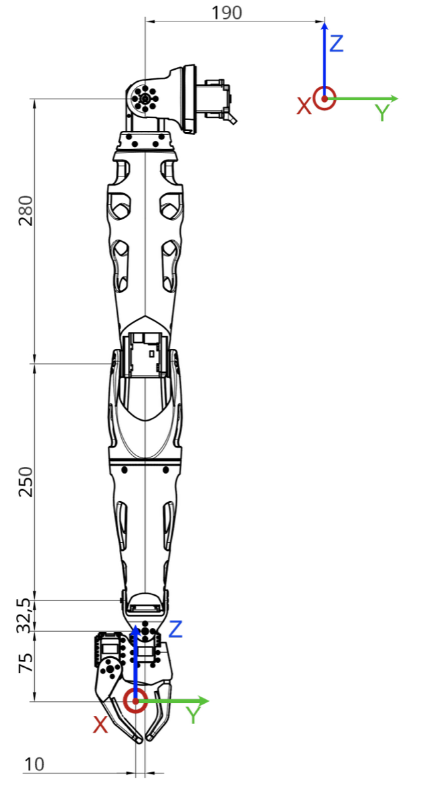
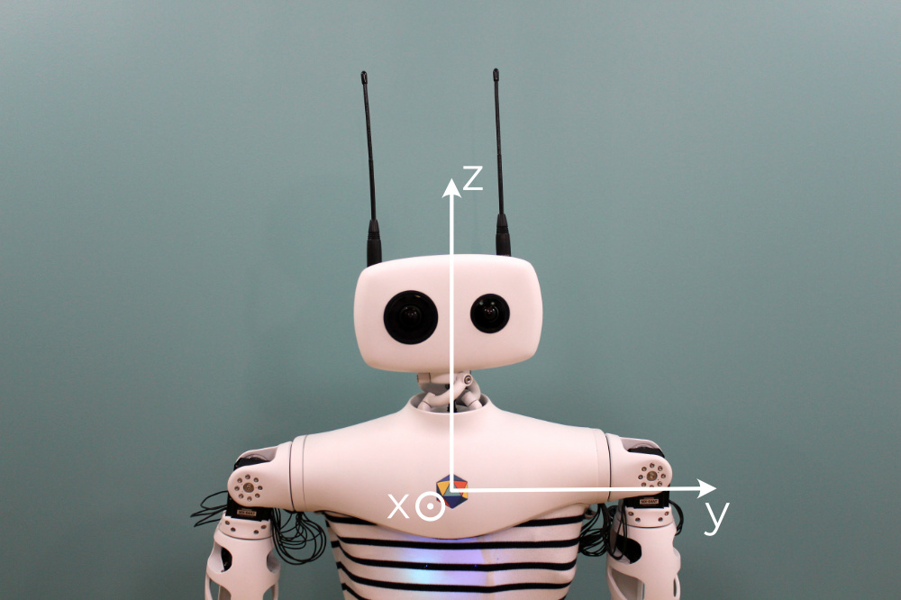
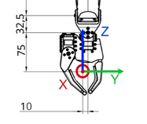
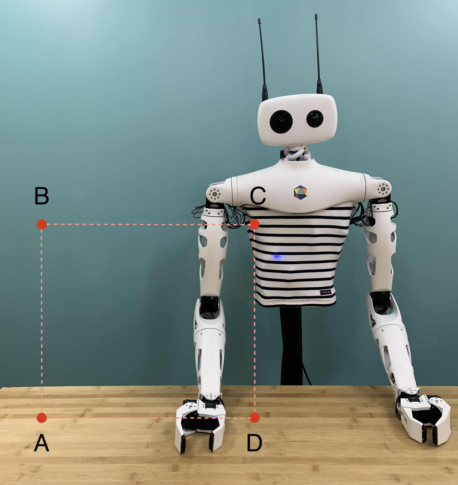

Make sure you checked the [safety page]() before controling the arm.

This page assumes that you went through the [Hello World]() so that you know how to connect to the robot and that you also know how to use the *goto()* function presented in [Controling the arm]().

## Arm coordinate system

### Joint coordinates

If you remember the [*goto()* function](), to generate a trajectory for the requested joints you need to pass a dictionnary of joints with the requested position as the *goal_positions* argument.

For example, to place the right arm in a right angled position, we defined the *right_angled_position* dictionnary. 

```python
right_angled_position = {
    reachy.r_arm.r_shoulder_pitch: 0,
    reachy.r_arm.r_shoulder_roll: 0,
    reachy.r_arm.r_arm_yaw: 0,
    reachy.r_arm.r_elbow_pitch: -90,
    reachy.r_arm.r_forearm_yaw: 0,
    reachy.r_arm.r_wrist_pitch: 0,
    reachy.r_arm.r_wrist_roll: 0,
}
```

and then used *goto()* like this:

```python
goto(
	goal_positions=right_angled_position,
	duration=1.0,
	interpolation_mode=InterpolationMode.MINIMUM_JERK
	)
```

Here we have used what is called **joint coordinates** to move Reachy. This means that we have controlled each joint separately.

The thing is that controlling a robot in joint coordinates can be hard and is often far from what we actually do as humans. When we want to grasp an object in front of us, we think of where we should put our hand, not how to flex each individual muscle to reach this position. This approach relies on the cartesian coordinates: the 3D position and orientation in space, this is where the **kinematic model** comes into play.

### Kinematic model

The **kinematic model** describes the motion of a robot in mathematical form without considering the forces and torque affecting it. It only focuses on the geometric relationship between elements.

We have defined the whole kinematic model of the arm. This means the translation and rotation required to go from one joint to the next one. On a right arm equipped with a force gripper this actually look like this:

|Motor|Translation|Rotation|
|-----|-----------|--------|
|r_shoulder_pitch|(0, -0.019, 0)|(0, 1, 0)
|r_shoulder_roll|(0, 0, 0)|(1, 0, 0)
|r_arm_yaw|(0, 0, 0)|(0, 0, 1)
|r_elbow_pitch|(0, 0, -0.28)|(0, 1, 0)
|r_forearm_yaw|(0, 0, 0)|(0, 0, 1)
|r_wrist_pitch|(0, 0, -0.25)|(0, 1, 0)
|r_wrist_roll|(0, 0, -0.0325)|(1, 0, 0)
|r_gripper|(0, -0.01, -0.075)|(0, 0, 0)


To use and understand the kinematic model, you need to know how Reachy coordinate system is defined (from Reachy's perspective), see below:

<p align="center">
  
</p>

* the X axis corresponds to the foward arrow,
* the Y axis corresponds to the right to left arrow,
* the Z axis corresponds to the up arrow.

The origin of this coordinate system is located in the upper part of the robot trunk, inside Reachy.
 Basically, if you imagine a segment going from the left shoulder to the right shoulder of the robot, the origin is the middle of this segment, which corresponds to behind the center of Pollen's logo on Reachy's torso.

<p align="center">
  
</p>

The units used for this coordinate system are the meter. So the point (0.3, -0.2, 0) is 30cm in front of the origin, 20cm to the right and at the same height.

### Switching between joint and cartesian coordinates

Forward and inverse kinematics are a way to go from one coordinates system to the other:

* **forward kinematics: joint coordinates –> cartesian coordinates**,
* **inverse kinematics: cartesian coordinates –> joint coordinates**.

## Forward kinematics

Using the kinematic model defined above, we can compute the 3D position and orientation of the right or left end-effector with the *forward_kinematics* method.

We consider the end-effector to be in a virtual joint located in the gripper and referred as *'right_tip'* or *'left_tip'* in the [urdf file](https://github.com/pollen-robotics/reachy_kinematics/blob/master/reachy.URDF), as shown below.

<p align="center">
  
</p>

The red dot corresponds to the *'right_tip'*.

You can see the right and left end-effectors animated below.

<video controls="controls" width="50%" autoplay loop>
  <source type="video/mp4" src="eef.mp4"></source>
  <source type="video/webm" src="orbita.webm"></source>
  <p>Your browser does not support the video element.</p>
</video>

Each arm has a *forward_kinematics* method. To use it, you first need to connect to your Reachy.

```python
from reachy_sdk import ReachySDK

reachy = ReachySDK(host='192.168.0.42')  # Replace with the actual IP

reachy.r_arm.forward_kinematics()
>>> array([[ 0.04622308, -0.03799621, -0.99820825,  0.31144822],
       [ 0.10976691,  0.99341829, -0.03273101, -0.19427524],
       [ 0.99288199, -0.1080573 ,  0.05008958, -0.4255104 ],
       [ 0.        ,  0.        ,  0.        ,  1.        ]])
```

The 4x4 matrix returned by the *forward_kinematics* method is what is often called a **pose**. It actually encodes both the 3D translation (as a 3D vector) and the 3D rotation (as a 3x3 matrix) into one single representation.

$$\begin{bmatrix}
R_{11} & R_{12} & R_{13} & T_x\\\\\\
R_{21} & R_{22} & R_{23} & T_y\\\\\\
R_{31} & R_{32} & R_{33} & T_z\\\\\\
0 & 0 & 0 & 1
\end{bmatrix}$$

The instruction

```python
reachy.r_arm.forward_kinematics()
```

returns the current pose of the right end-effector, based on the present position of every joint in the right arm.

You can also compute the pose for a given joints position, to do that just pass the list of position as argument of forward_kinematics. Be careful to respect the order of the position you give and to give all the joints in the arm kinematic chain (i.e. from *shoulder_pitch* to *wrist_roll*).

For example, we can compute the forward kinematics for the right-angle position we defined earlier.

```python
reachy.r_arm.forward_kinematics(right_angle_position.values())
>>> array([[ 0.    ,  0.    , -1.    ,  0.3675],
       [ 0.    ,  1.    ,  0.    , -0.202 ],
       [ 1.    ,  0.    ,  0.    , -0.28  ],
       [ 0.    ,  0.    ,  0.    ,  1.    ]])
```

With this result, we can tell that when the right arm is in the right angle position, the right end-effector is 37cm in front of the origin, 20cm to the left and 28cm below the origin.

As of the rotation matrix, the identity matrix corresponds to the zero position of the robot which is when the hand is facing toward the bottom.

Here we obtained the rotation matrix

$$\begin{bmatrix}
0 & 0 & -1\\\\\\
0 & 1 & 0 \\\\\\
1 & 0 & 0
\end{bmatrix}$$

We can use scipy to understand what this matrix represents.

```python
from scipy.spatial.transform import Rotation as R
import numpy as np

R.from_matrix([
    [0, 0, -1],
    [0, 1, 0],
    [1, 0, 0],
]).as_euler('xyz', degrees=True)
>>> array([  0.        , -89.99999879,   0.        ])
```
So scipy tells us that a rotation of -90° along the y axis has been made to get this matrix, which is coherent with the result because having the hand facing forward corresponds to this rotation according to Reachy's xyz axis that we saw above.

## Inverse kinematics

Knowing where you arm is located in the 3D space can be useful but most of the time what you want is to move the arm in cartesian coordinates. You want to have the possibility to say: “move your hand to [x, y, z] with a 90° rotation around the Y axis”.

This is what inverse kinematics does. We have provided a method to help you with that. You need to give it a 4x4 target pose, like the one given by the forward kinematics, and an initial joint state.

### Example: square movement

#### Defining the poses

To make this more concrete, let's first try with a simple example. We will make the right hand draw a square in 3D space. To draw it, we will define the four corners of a square and Reachy's right hand will go to each of them.

The virtual corner is represented below.

<p align="center">
  
</p>


For our starting corner A, let's imagine a point in front of the robot, on its right and below its base. With Reachy coordinate system, we can define such a point with the following coordinates:

$$A = \begin{pmatrix}0.3 & -0.4 & -0.3\end{pmatrix}$$

The coordinates of B should match A except the z component wich should be higher. Hence 

$$B = \begin{pmatrix}0.3 & -0.4 & 0.0\end{pmatrix}$$

For the corner C, we want a point on the same z level as B in the inner space of Reachy and in the same plane as A and B so we only need to change the y component of B. We can take for example 

$$C = \begin{pmatrix}0.3 & -0.1 & 0.0\end{pmatrix}$$

And to complete our corners we can deduce D from A and C. D coordinates should match C except its z component which must the same as A. Hence

$$D = \begin{pmatrix}0.3 & -0.1 & -0.3\end{pmatrix}$$

> **Remember that you always have to provide poses to the inverse kinematics that are actually reachable by the robot.** If you're not sure whether the 3D point that you defined is reachable by Reachy, you can move the arm with your hand in compliant mode, ask the forward kinematics and check the 3D translation component of the returned pose. 

But having the 3D position is not enough to design a pose. You also need to provide the 3D orientation via a rotation matrix. The rotation matrix is often the tricky part when building a target pose matrix.

Keep in mind that the identity rotation matrix corresponds to the zero position of the robot which is when the hand is facing toward the bottom. So if we want the hand facing forward when drawing our virtual square, we need to rotate it from -90° around the y axis, as we saw in the forward kinematics part.

We know from before which rotation matrix corresponds to this rotation, but we can use scipy again to generate the rotation matrix for given rotations.

```python
print(np.around(R.from_euler('y', np.deg2rad(-90)).as_matrix(), 3))
>>> [[ 0. -0. -1.]
 [ 0.  1. -0.]
 [ 1.  0.  0.]]
```

We got the rotation matrix that we expected!

As mentionned, building the pose matrix can be hard, so don't hesitate to use scipy to build your rotation matrix. You can also move the arm with your hand where you want it to be and use the forward kinematics to get an approximation of the target pose matrix you would give to the inverse kinematics.

Here, having the rotation matrix and the 3D positions for our points A and B, we can build both target pose matrices.

```python
A = np.array([
  [0, 0, -1, 0.3],
  [0, 1, 0, -0.4],  
  [1, 0, 0, -0.3],
  [0, 0, 0, 1],  
])

B = np.array([
  [0, 0, -1, 0.3],
  [0, 1, 0, -0.4],  
  [1, 0, 0, 0.0],
  [0, 0, 0, 1],  
])

C = np.array([
  [0, 0, -1, 0.3],
  [0, 1, 0, -0.1],  
  [1, 0, 0, 0.0],
  [0, 0, 0, 1],  
])

D = np.array([
  [0, 0, -1, 0.3],
  [0, 1, 0, -0.1],  
  [1, 0, 0, -0.3],
  [0, 0, 0, 1],  
])
```

#### Computing the joint positions

*inverse_kinematics()* takes one optional argument, *q0*, which is the starting point of the inverse kinematics computation. If no *q0* is given, *q0* is considered to be equal to the present joints position.

Inverse kinematics is a really powerful way to define motions in coordinate systems that fits better with the defintion of many tasks (grasp the bottle in (x, y, z) for instance). Yet, this approach has also some important limitations.

It's important to understand that while the forward kinematics has a unique and well defined solution, the inverse kinematics is a much harder and ill defined problem. A Right Arm with a Gripper has 8 Degrees Of Freedom meaning that you may have multiple solutions to reach the same 3D point in space.

Because the inverse kinematics algorithm used is based on optimisation techniques, giving a starting point *q0* may have a tremendous influence on the final result.

Now let's use the inverse kinematics to move between our two points A and B! We will consider that the starting point is the right angled position that we used before, then the arm will go to A and finish at B.

```python
joint_pos_A = reachy.r_arm.inverse_kinematics(A)
joint_pos_B = reachy.r_arm.inverse_kinematics(B)
joint_pos_C = reachy.r_arm.inverse_kinematics(C)
joint_pos_D = reachy.r_arm.inverse_kinematics(D)
```

#### Sending the movements commands

As before, we use the *goto()* to send moving instructions to the arm.


```python
import time
# put the joints in stiff mode
reachy.turn_on('r_arm')

# use the goto function
goto({joint: pos for joint,pos in zip(reachy.r_arm.joints.values(), joint_pos_A)}, duration=1.0)
time.sleep(0.5)
goto({joint: pos for joint,pos in zip(reachy.r_arm.joints.values(), joint_pos_B)}, duration=1.0)
time.sleep(0.5)
goto({joint: pos for joint,pos in zip(reachy.r_arm.joints.values(), joint_pos_C)}, duration=1.0)
time.sleep(0.5)
goto({joint: pos for joint,pos in zip(reachy.r_arm.joints.values(), joint_pos_D)}, duration=1.0)

# put the joints back to compliant mode
# use turn_off_smoothly to prevent the arm from falling hard
reachy.turn_off_smoothly('r_arm')
```

The result should look like this:

<video controls="controls" width="75%" autoplay loop>
  <source type="video/mp4" src="goto_ik.mp4"></source>
  <source type="video/webm" src="orbita.webm"></source>
  <p>Your browser does not support the video element.</p>
</video>