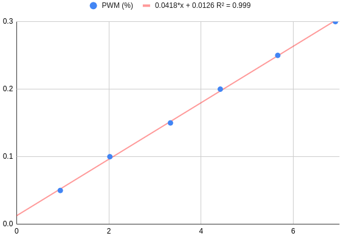

## Drive modes
### Overview
The drive mode impacts the way the mobile base accepts commands. We could say it's the current state of the mobile base.

In most cases, there is no need to think about these modes or to handle them in your code. Below are the most common use cases.
* If you want to use the set_speed method to spam speed commands (e.g. pilot the robot with a controller), the mode has to be manually changed to 'cmd_vel':
  ```python
  reachy.mobile.drive_mode = 'cmd_vel'
  ```
* If you want to push the robot easily, this will set the wheels in a compliancy state:
  ```python
  reachy.mobile.drive_mode = 'free_wheel'
  ```
* On the contrary, if you want the robot to apply a passive resistance to movement, use:
  ```python
  reachy.mobile.drive_mode = 'brake'
  ```

You can use this [Jupyter Notebook](https://github.com/pollen-robotics/mobile-base-sdk/blob/main/mobile_base_sdk/examples/notebooks/drive-modes.ipynb) to explore the drive modes with your mobile base.

### Detailed behaviour
This section is only useful if you intend to interact directly with the Hardware Abstraction Layer (HAL).

Six drive modes are available for the mobile base:
* **cmd_vel**: in this mode, speed instructions can be spammed to the wheels controllers. This mode is used for the *set_speed* method.
* **brake**: in this mode, the wheels will be stiff.
* **free_wheel**: in this mode, the wheels will be as compliant as possible.
* **emergency_stop**: in this mode, the wheels will stop receiving mobility commands. Switching to this mode will also stop the mobile base hal code. This is a safety mode. 
* **speed**: another mode to send speed instructions, but less frequently than with the cmd_vel mode. This mode is actually not used at this level (python SDK level), but is implemented at the ROS level, in case one might need it.
* **goto**: this mode is used for the *goto* method.

*note: the 'speed' and 'goto' modes can't be changed by hand. The drive mode is handled automagically when requesting a set_speed or a goto.*

The code for the [HAL can be found here](https://github.com/pollen-robotics/zuuu_hal)

## Control modes
### Overview
The control mode dictates the low level control strategy used by the mobile bases's HAL.

Two control modes are possible:
* ***open_loop*** (default mode): in this mode, the wheels are compliant and the control is smoother.
  ```python
  reachy.mobile.control_mode = 'open_loop'
  ```

* ***pid***: in this mode, the wheels are stiff and the control is more precise.
  ```python
  reachy.mobile.control_mode = 'pid'
  ```
:bulb: We recommend that you run the following [Jupyter Notebook](https://github.com/pollen-robotics/mobile-base-sdk/blob/main/mobile_base_sdk/examples/notebooks/control-modes.ipynb) to get a feel of what the control mode does.

### Detailed behaviour
Regardless of how the mobile base is piloted (goto, set_speed, controller), the HAL always ends up calculating a goal rotational speed for each wheel.
The control mode only changes the used strategy to reach that rotational speed.
* In the open_loop mode, a simple affine model was identified to match a PWM to a goal rotational speed. The VESC controllers then apply the PWM directly to the motors of the wheels, without any other low level control. The measures can be found [here](https://github.com/pollen-robotics/zuuu_hal/tree/main/measures). While the model is simple, it does account for the static friction and the experimental data shows a good fit when the mobile base is on a flat surface.
<p align="center">
  
</p>

* In the pid mode, the HAL gives the goal rotational speeds directly to the VESC controllers of each wheel. The VESC will use a PID controller to control the speeds. 