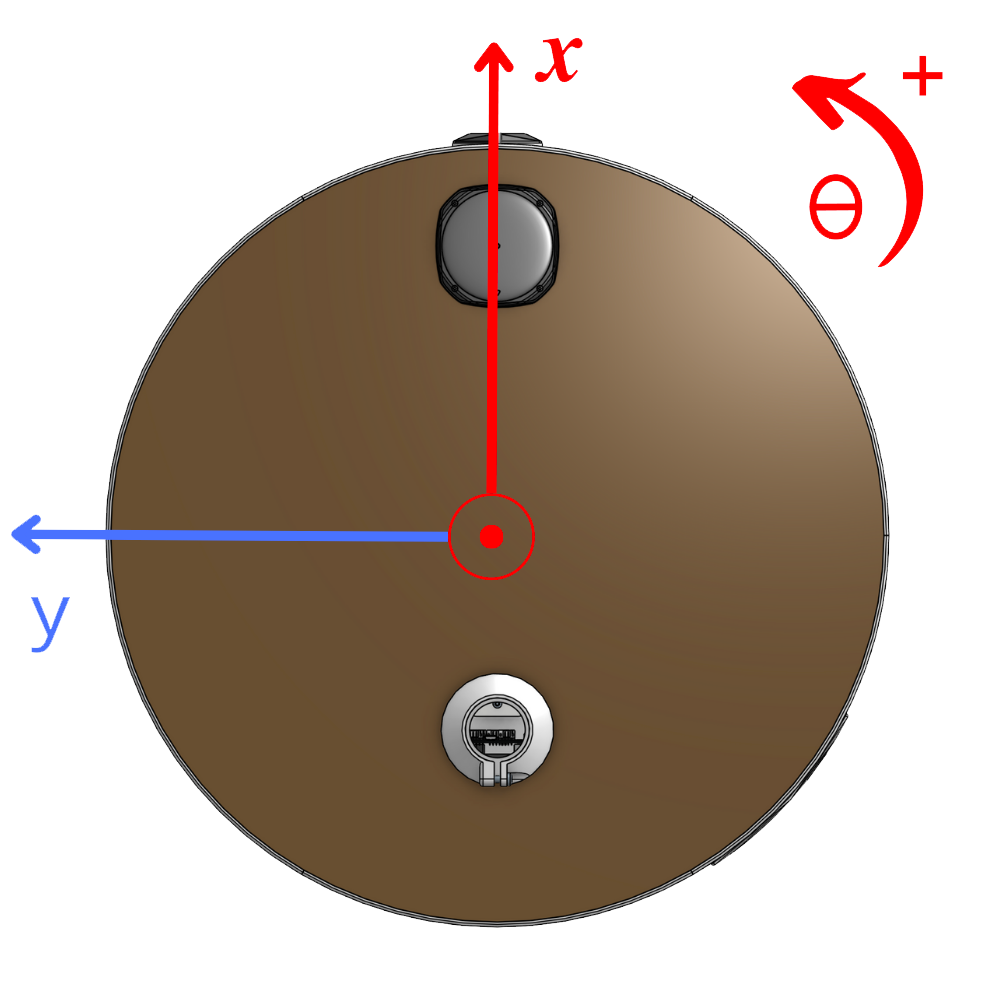
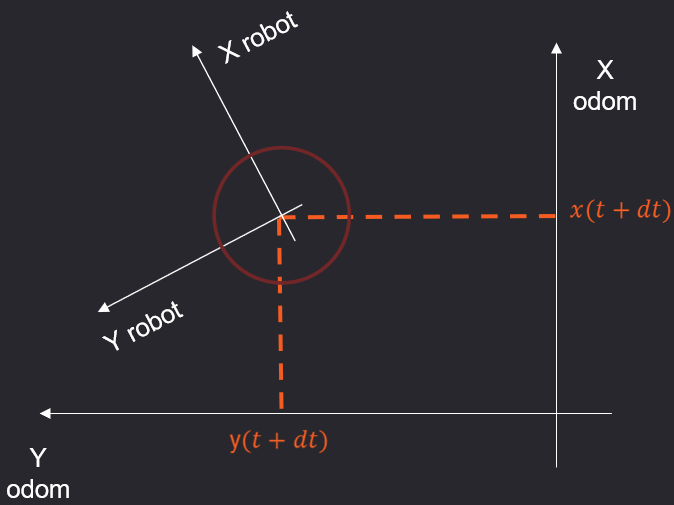

## Frame conventions
### REP 105 “Coordinate Frames for Mobile Platforms”
Our design is coherent with ROS' conventions described in [REP 105 “Coordinate Frames for Mobile Platforms”](https://www.ros.org/reps/rep-0105.html)

### Robot frame
The robot frame or egocentric frame or base_link frame is **rigidly attached to the robot**. Its (0, 0) point is the projection on the floor of the center of the mobile base.
**X in front, Y to the left, Theta positive counterclockwise.**
<p align="center">
  
</p>

### Odom frame
The odom frame is a **world-fixed frame**. The position (x, y, theta) of the robot in the odom frame is continuously updated by the HAL through odometry calculations. These calculations currently only use the measurements from the wheels to estimate the movement of the robot. While the position of the robot is continuous, **it should never be relied upon for long-term reference as it will always drift.**

<p align="center">
  
</p>

The initial position of the odom frame matches the position of the robot when the HAL was started. The odom frame can also be reset to the current position of the robot using:
  ```python
  reachy.mobile.reset_odometry()
  ```


## Moving the mobile base
There are two interfaces in the SDK to control the mobile base: spamming speed commands or setting a goal position in the odom frame.
### Using the set_speed method
Since the mobile base is holonomic, the set_speed method expects 3 speed commands expressed in the robot frame:
- x_vel, in m/s. The instantaneous speed positive in front of the robot.
- y_vel, in m/s. The instantaneous speed positive to the left of the robot.
- rot_vel, in deg/s. The instantaneous rotational speed positive counterclockwise.

See the [joy_controller code](https://github.com/pollen-robotics/mobile-base-sdk/blob/main/mobile_base_sdk/examples/scripts/joy_controller.py) for a working example.

:bulb: As a safety measure, the HAL will stop the wheels if it didn't receive a new goal speed in the last 200ms.

:bulb: The way this is implemented in the HAL is simply to listen to the /cmd_vel topic, apply some smoothing, perform the kinematic calculations and send the speed commands to the wheels. This makes it very easy to create control interfaces using ROS, see the [keyboard example](https://github.com/pollen-robotics/zuuu_hal/blob/main/examples/zuuu_teleop_keyboard.py) or the [joy controller example](https://github.com/pollen-robotics/zuuu_hal/blob/main/examples/zuuu_teleop_joy.py).

*Note: the HAL has a drive mode to set speed commands for variable amounts of time. Instead of relying on a topic, it creates a service. The niche usage didn't warrant the added complexity, so the interface with the SDK was not made. But if needed, it exists!*
### Using the goto method
The goto method expects a goal position in the odom frame, composed of 3 elements: x in m, y in m and theta in deg.

:warning: The most important thing to get used to, is the fact that the odom frame is world-fixed and that the position of the robot is always updated as long as the HAL is running (the HAL is automatically started during the robot boot-up). So by default, **if you ask for a ```goto(0, 0, 0)``` the robot will try to comeback to the position it was at boot-up.**

To perform a goto relative to the current position of the robot, use the method ```reset_odometry()```. For example, create an instance of reachy with:

```python
from reachy_sdk import ReachySDK

reachy_mobile = ReachySDK(host='your-reachy-ip', with_mobile_base=True)
```

Reset the odometry frame, and ask the robot to move 50cm in front of it:
```python
reachy_mobile.mobile_base.reset_odometry()
reachy_mobile.mobile_base.goto(x=0.5, y=0.0, theta=0.0)
```
Now, ask for a goto(0,0,0). The robot should go back to its previous position:
```python
reachy_mobile.mobile_base.goto(x=0.0, y=0.0, theta=0.0)
```

**We recommend taking the time to play around with this concept.** You can use [this Jupyer notebook to explore the goto method.](https://github.com/pollen-robotics/mobile-base-sdk/blob/main/mobile_base_sdk/examples/notebooks/goto.ipynb)

By default, the robot will always try to reach the goal position, meaning that even if the robot did reach its position and you push it, it will try to come back to the the goal position again.

However, you can define two types of stop conditions through optional parameters (see the above Jupyter notebook for a working example).
- A timeout, expressed in seconds. The robot stops the goto when the elapsed time since the start of the command is superior to the timeout. There is a **default timeout that scales with the distance asked by the goto**.
- A spatial tolerance, expressed with 4 values: delta_x (the error in m along the X axis), delta_y (the error in m along the Y axis), delta_theta (the angle error in deg) and distance (the l2 distance between the current position and the goal position in m). The robot stops the goto when it is close enough to satisfy all 4 conditions simultaneously.
explored in :

:bulb: *Note: the goto behaviour is implemented in the HAL using 3 independent PIDs, one to reduce delta_x, one for delta_y and one for delta_theta. The PIDs can't be tuned at the SDK level, but they can at the HAL level.*