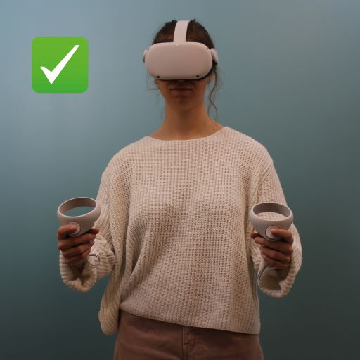
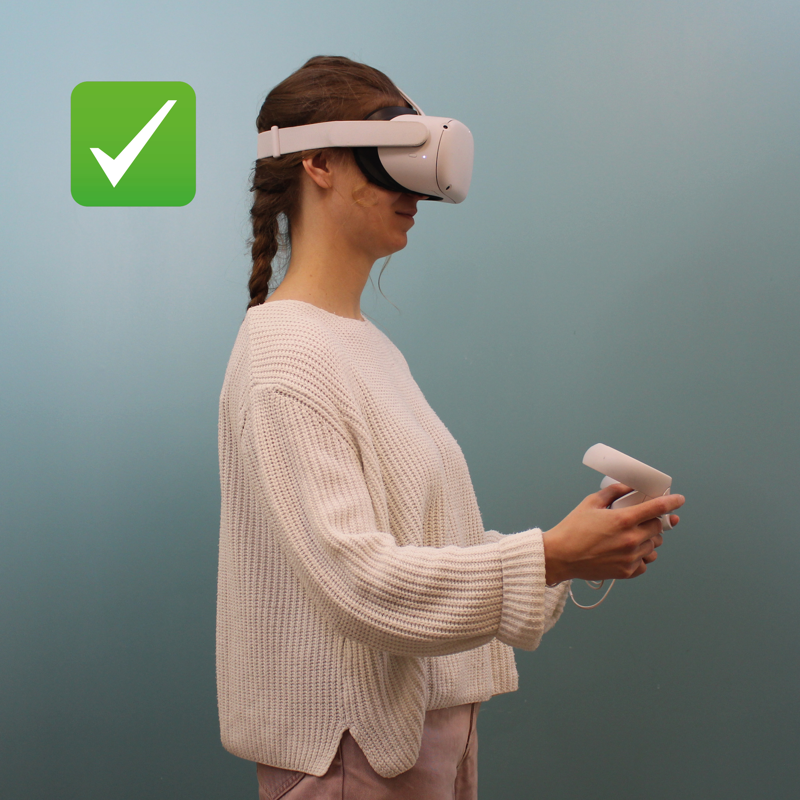



The teleoperation application use has nothing complicated, but you need to respect a few guidelines to avoid damaging the robot when using it. This page goes through the main elements you need to keep in mind while teleoperating Reachy. The guidelines are not exhaustive, but should give you a good start on how to use the application safely.

## Ideal use of teleoperation

The ideal position to start teleoperation may depend on the surrounding of Reachy. Nevertheless, if the robot environment is compatible with it, we advise to start with the elbows at 90 degrees, lightly away from the torso.

 
 
Here is a video of movements and positions that are visually suitable for teleoperation:
 
 

<video controls="controls" width="80%" autoplay loop>
  <source type="video/mp4" src="ChestOk.mp4"></source>
  <source type="video/webm" src="ChestOk.webm"></source>
  
Your browser does not support the video element.

</video>

 
Follow all the elements described in the next sections to teleoperate Reachy in the best conditions! 

## All guidelines in video
Watch this quick video to have an overview of the main guidelines to use teleoperation:  

<video controls="controls" width="80%" loop>
  <source type="video/mp4" src="AllGuidelines.mp4"></source>
  <source type="video/webm" src="AllGuidelines.webm"></source>
  
Your browser does not support the video element.

</video>

 
The next sections go deeper into each guideline presented in the video and the risks of not following them.

## Keep the right position 
The mapping between your position and the robot is made when clicking on (A) to start teleoperation. The position and rotation of your headset <b>at this moment</b> is used to create a static coordinate system in which the controllers positions and rotations and the headset rotation are calculated. If you move (change either your body position or orientation), the controllers positions will still be calculated in the previous static coordinate system, and Reachy movements won't look like like yours anymore.  
For these reasons, you must:

- <b>Not move your feet</b> when teleoperating Reachy: they must stay static on the floor.

<video controls="controls" width="40%" loop>
  <source type="video/mp4" src="FeetOk.mp4"></source>
  <source type="video/webm" src="FeetOk.webm"></source>
  
Your browser does not support the video element.

</video>

<video controls="controls" width="40%" loop>
  <source type="video/mp4" src="FeetNotOk.mp4"></source>
  <source type="video/webm" src="FeetNotOk.webm"></source>
  
Your browser does not support the video element.

</video>  

- <b>Not rotate your torso</b>.
In fact, Reachy's torso won't move, only the arms will try to reach the positions, and this may lead to collision between the Reachy's arms and torso.

<video controls="controls" width="40%" loop>
  <source type="video/mp4" src="ChestOk.mp4"></source>
  <source type="video/webm" src="ChestOk.webm"></source>
  
Your browser does not support the video element.

</video>

<video controls="controls" width="40%" loop>
  <source type="video/mp4" src="ChestNotOk.mp4"></source>
  <source type="video/webm" src="ChestNotOk.webm"></source>
  
Your browser does not support the video element.

</video>

## Avoid movements discontinuities
Reachy doesn't have the exact same degrees of freedom as you have, neither the same range for each joints. When a position cannot be reached, either because of the position or the orientation, the inverse kinematics gives the closest arm configuration found. The closest configuration found for the next position may be:

- the same as the previous one, so the arm won't move and you have the impression Reachy is not following your movements anymore
- quite different from the previous one, which will lead to sudden changes of the arm position

All this contribute to give movements that seem incontrollable, due to discontinuities in the arm's inverse kinematics.

**To avoid this situation:**

- Avoid using extreme joints orientations while teleoperating Reachy
- Avoid unusual arm positions, there are probably above Reachy's joints limits

<video controls="controls" width="40%" loop>
  <source type="video/mp4" src="MovementsOk.mp4"></source>
  <source type="video/webm" src="MovementsOk.webm"></source>
  
Your browser does not support the video element.

</video>

<video controls="controls" width="40%" loop>
  <source type="video/mp4" src="MovementsNotOk.mp4"></source>
  <source type="video/webm" src="MovementsNotOk.webm"></source>
  
Your browser does not support the video element.

</video>

- The most limiting joint is the elbow: avoid working to close to your chest, the elbow will be at the limit of its range of motion

<video controls="controls" width="40%" loop>
  <source type="video/mp4" src="TorsoArmOk.mp4"></source>
  <source type="video/webm" src="TorsoArmOk.webm"></source>
  
Your browser does not support the video element.

</video>

<video controls="controls" width="40%" loop>
  <source type="video/mp4" src="TorsoArmNotOk.mp4"></source>
  <source type="video/webm" src="TorsoArmNotOk.webm"></source>
  
Your browser does not support the video element.

</video>

- If the robot seems to stop following your movements, do not continue to move in this direction, you have already reached its workspace limit. Go back to a position you know can be reached.

## Avoid damaging motors
Reachy's arms have been thought to manipulate object at a table level and nearby.
Some positions away from this nominal area can require a lot of effort from the motors to be maintained, and cause them to overheat fast. Moreover, manipulating objects requires more effort from the motors.

**To avoid damaging motors:**

- Avoid doing movements above your head
- Avoid keeping your arms straight ahead horizontally to the floor, where the shoulders motors have to carry all the weight of the arms in a static position

<video controls="controls" width="40%" loop>
  <source type="video/mp4" src="AboveHeadOk.mp4"></source>
  <source type="video/webm" src="AboveHeadOk.webm"></source>
  
Your browser does not support the video element.

</video>

<video controls="controls" width="40%" loop>
  <source type="video/mp4" src="AboveHeadNotOk.mp4"></source>
  <source type="video/webm" src="AboveHeadNotOk.webm"></source>
  
Your browser does not support the video element.

</video>

- Do not let the motors in stiff mode when you are in the menu if you are not going to teleoperate the robot soon
- Do not try to lift objects that are above Reachy's capabilities. If you try to lift an object and see that Reachy's arm can follow your movement or if you head some crackling noise coming from the motors, it probably means that the object is too heavy for Reachy's arm.

<video controls="controls" width="40%" loop>
  <source type="video/mp4" src="WeightOk.mp4"></source>
  <source type="video/webm" src="WeightOk.webm"></source>
  
Your browser does not support the video element.

</video>

<video controls="controls" width="40%" loop>
  <source type="video/mp4" src="WeightNotOk.mp4"></source>
  <source type="video/webm" src="WeightNotOk.webm"></source>
  
Your browser does not support the video element.

</video>

## Avoid damaging 3D parts
Hitting Reachy's arms on objects can damage the painting or even break 3D parts of the robot. It may happen even if the arms crash into something at moderate speed.

**To avoid damaging 3D parts:**
- Check the environment surrounding the robot before starting the teleoperation. Make sure you have enough space around the robot and that there is no object to be hit by the robot (this may also save your object from being broken...)

<video controls="controls" width="40%" loop>
  <source type="video/mp4" src="CheckSpaceRobotOk.mp4"></source>
  <source type="video/webm" src="CheckSpaceRobotOk.webm"></source>
  
Your browser does not support the video element.

</video>

<video controls="controls" width="40%" loop>
  <source type="video/mp4" src="CheckSpaceRobotNotOk.mp4"></source>
  <source type="video/webm" src="CheckSpaceRobotNotOk.webm"></source>
  
Your browser does not support the video element.

</video>

- Stop teleoperation close to the position which will be reached when the motors will be compliant, so that the arms won't fall from high.

<video controls="controls" width="40%" loop>
  <source type="video/mp4" src="StopArmOk.mp4"></source>
  <source type="video/webm" src="StopArmOk.webm"></source>
  
Your browser does not support the video element.

</video>

<video controls="controls" width="40%" loop>
  <source type="video/mp4" src="StopArmNotOk.mp4"></source>
  <source type="video/webm" src="StopArmNotOk.webm"></source>
  
Your browser does not support the video element.

</video>

## Use teleop safely
- Check the environment around you before starting teleoperation.

<video controls="controls" width="40%" loop>
  <source type="video/mp4" src="CheckSpaceOk.mp4"></source>
  <source type="video/webm" src="CheckSpaceOk.webm"></source>
  
Your browser does not support the video element.

</video>

<video controls="controls" width="40%" loop>
  <source type="video/mp4" src="CheckSpaceNotOk.mp4"></source>
  <source type="video/webm" src="CheckSpaceNotOk.webm"></source>
  
Your browser does not support the video element.

</video>

- Stop teleoperation before removing your headset! You must be back in the menu before dropping the controllers and removing your headset, because Reachy will continue following your movements until you stopped it.

<video controls="controls" width="40%" loop>
  <source type="video/mp4" src="RemoveHeadsetOk.mp4"></source>
  <source type="video/webm" src="RemoveHeadsetOk.webm"></source>
  
Your browser does not support the video element.

</video>

<video controls="controls" width="40%" loop>
  <source type="video/mp4" src="RemoveHeadsetNotOk.mp4"></source>
  <source type="video/webm" src="RemoveHeadsetNotOk.webm"></source>
  
Your browser does not support the video element.

</video>

## Familiarize yourself with the robot
- Before trying to make application or to achieve anything using teleoperation with the robot, familiarize yourself with its movements, its workspace and its joints limits.
- Stay near the robot for your first trials: listen to the motors sounds, be aware of your workspace and field of view in a environment you know, try to manipulate light objects.
- Explore your own workspace with small and quite slow movements to see how the robot reacts and better understand the relation between your movements and its.

