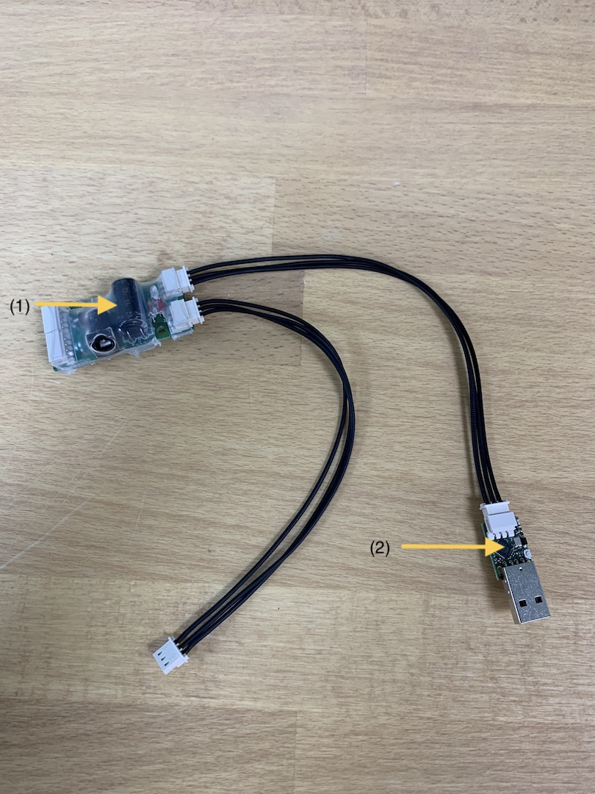

## Product

| Arm kit |
|---------|


## Reachy's arm

(1) : 12V Power supply board (SMPS2Dynamixel)  
(2) : USB to serial board (Need to be connected to your computer)  

The arms specifications are available in section [Arm mechanical specifications]().