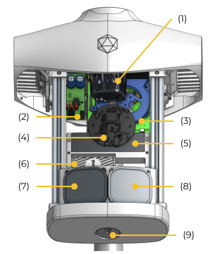
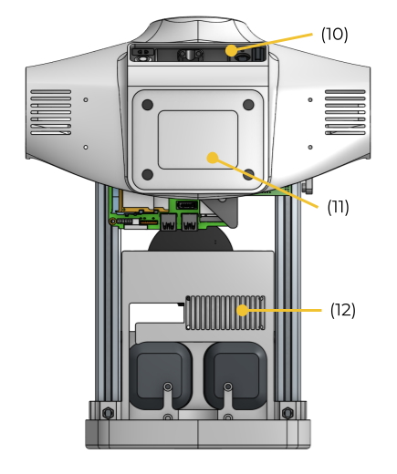
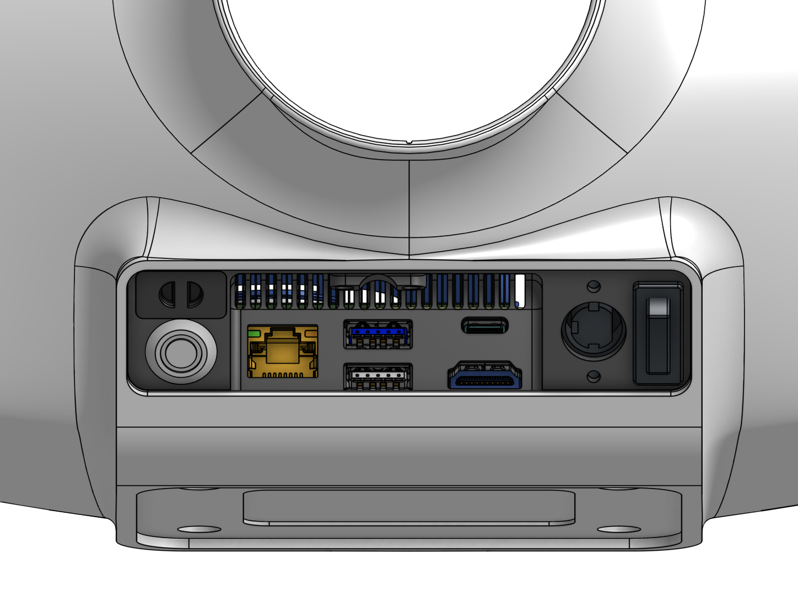
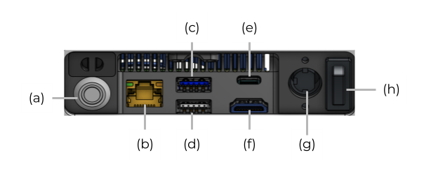
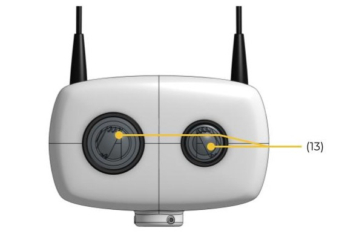
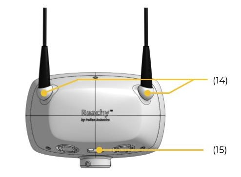

## Product

| Starter kit | Full kit|
|---------|------------|
|||

## Reachy's torso

### Front

(1) : Motors and fan’s housing for Orbita neck  
(2) : Power board  
(3) : Intel NUC embedded computer  
(4) : Microphone  
(5) : USB hub  
(6) : Google Coral TPU  
(7) : Right loudspeaker  
(8) : Left loudspeaker  
(9) : Loudspeakers volume button  

### Back

(10) : Hardware interface (see image below for details)  
(11) : Fixations interface  
(12) : Coral cooling/airing grid  

## Reachy's hardware interface

(a) : Embedded computer on/off (NUC)  
(b) : Ethernet port  
(c) : USB-a 3.0 port (for cameras)  
(d) : USB-a 2.0 port  
(e) : USB-c port  
(f) : HDMI port  
(g) : Power supply port  
(h) : Motors alimentation on/off  

## Reachy's head

(13) : Right and left high quality motorized cameras and lenses  
(14) : Antennas' motorized fixations  
(15) : Head cables routing hole  