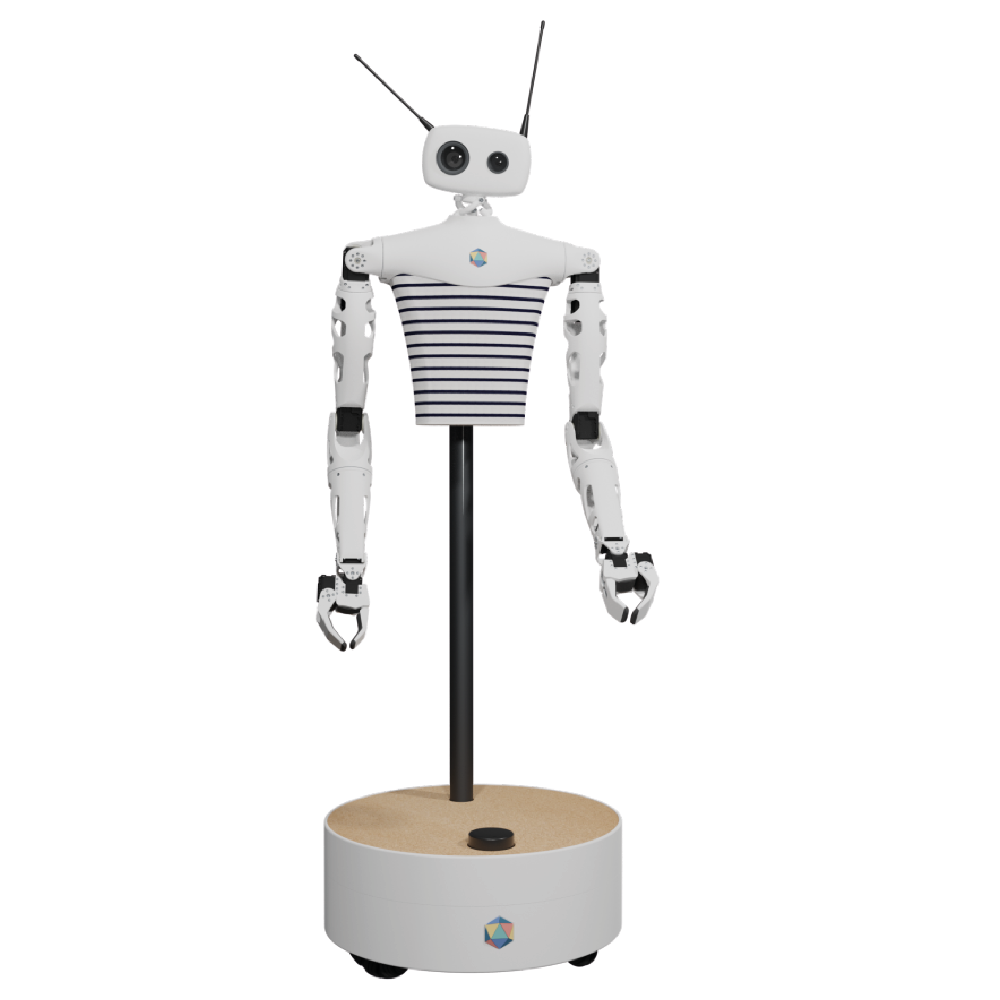

Reachy mobile is composed of two parts:
* a full kit Reachy robot (i.e. with two arms, torso and a head),
* an omnidirectional mobile base

  

The mobile base communicates with Reachy using an USB cable plugged in Reachy's back (id 'd' in [Reachy's hardware interface]())

For more info on what composes the mobile base, check the [mobile base specifications]().