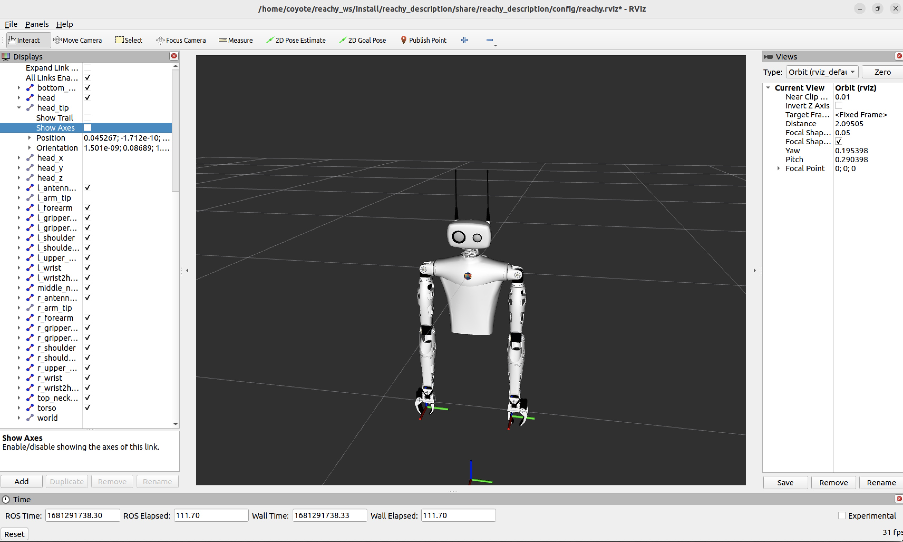
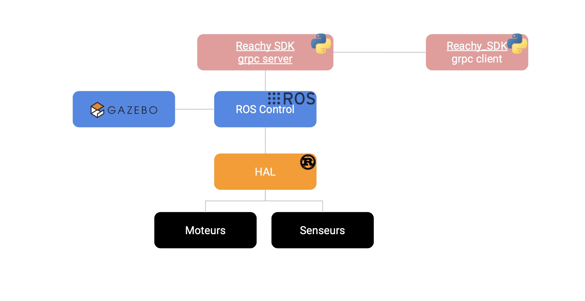

Reachy's software is composed of three main parts:

- **a HAL** (Hardware Abstraction Layer) handling the communication with Reachy's sensors i.e. the Dynamixel motors in the arms, fans, force sensors and Orbita actuator.
- **ROS packages:** this is the core of the software. We are using ROS (Robotics Operating System), more precisely the **ROS2 Humble distribution**, and interact with the HAL via [ros2 control](https://control.ros.org/master/index.html). ROS packages are used to compute the kinematics for Reachy's arms and Orbita, to get the camera feed and to manage the autofocus on Reachy's motorised zooms.   
Another ROS package is also used, along with gRPC, to create a server interacting with the different ROS nodes and services made for Reachy and allowing remote control on the robot without being physically connected to it.
    
- **gRPC client:** the strength of using the gRPC framework is that we can have a remote control to the robot and create clients in any programming language (Python, C++, C#, ...). So knowing how to use ROS is not needed to work with Reachy.

## Packages

The packages developed for Reachy 2023 are divided into two categories: the ROS packages and non-ROS packages.

### ROS 

(installed in ~/reachy_ws folder of Reachy's computer)

The main package is [**reachy_2023**](https://github.com/pollen-robotics/reachy_2023). It contains multiple sub-packages:

- [**reachy_description**](https://github.com/pollen-robotics/reachy_2023/tree/master/reachy_description): publishes the robot's URDF and control tag, needed by the kinematics package and by the different ROS simulation tools (rviz, gazebo, ...)

- [**reachy_kdl_kinematics**](https://github.com/pollen-robotics/reachy_2023/tree/master/reachy_kdl_kinematics): computes the forward / inverse kinematics of Reachy's arms and the forward / inverse kinematics of Orbita.

- [**reachy_controllers**](https://github.com/pollen-robotics/reachy_2023/tree/master/reachy_controllers): communicates with the HAL through [ROS control hardware interface](https://control.ros.org/master/doc/ros2_control/hardware_interface/doc/hardware_components_userdoc.html).
- [**camera_controllers**](https://github.com/pollen-robotics/reachy_2023/tree/master/camera_controllers): communicates with the camera using v4l2 and zoom.
- [**gripper_safe_controller**](https://github.com/pollen-robotics/reachy_2023/tree/master/gripper_safe_controller): Smart gripper controller that automatically adjusts target position to avoid forcing.

- [**reachy_msgs**](https://github.com/pollen-robotics/reachy_2023/tree/master/reachy_msgs): specific ROS messages for Reachy
- [**reachy_bringup**](https://github.com/pollen-robotics/reachy_2023/tree/master/reachy_bringup): bringup launch file (can launch real, fake or gazebo reachy with or without RViz, etc.)

- [**reachy_sdk_server**](https://github.com/pollen-robotics/reachy_2023/tree/develop/reachy_sdk_server): creates two gRPC servers, *camera_server* to get the camera's images and control the motorised zooms and *reachy_sdk_server* for the joints, load sensors, fans and Orbita.

  

##### Mobile base
The following package is only needed if you have a Reachy with mobile base:

- [**mobile_base_controller**](https://github.com/pollen-robotics/reachy_2023/tree/develop/mobile_base_controller)

with the following sub-packages:  

- [**zuuu_hal**](https://github.com/pollen-robotics/reachy_2023/tree/develop/mobile_base_controller/zuuu_hal): HAL dedicated to the mobile base
- [**zuuu_interfaces**](https://github.com/pollen-robotics/reachy_2023/tree/develop/mobile_base_controller/zuuu_interfaces): custom ROS services for the mobile base

:bulb: **Zuuu** is the internal name of the mobile base. It's a french onomatopoeia that evokes swift mouvements :) 

### Non-ROS 

(installed in ~/dev folder of Reachy's computer)

The main library you will use:
- [**reachy_sdk**](https://github.com/pollen-robotics/reachy-sdk): SDK Python to control Reachy and develop applications

Other dependencies for more specific use cases:
- [**reachy_sdk_api**](https://github.com/pollen-robotics/reachy-sdk-api): protobuf services and messages definition for the gRPC servers
- [**zoom_kurokesu**](https://github.com/pollen-robotics/zoom_kurokesu): Python library to control Reachy's motorized zooms

##### Mobile base
The following package is only needed if you have a Reachy with mobile base:

- [**mobile_base_sdk**](https://github.com/pollen-robotics/mobile-base-sdk): SDK Python to control Reachy's mobile base without necessarily having a Reachy robot connected. Controling the mobile base using [**reachy_sdk**](https://github.com/pollen-robotics/reachy-sdk) actually uses the [**mobile_base_sdk**](https://github.com/pollen-robotics/mobile-base-sdk) but hides it.

## gRPC clients

As explained, the gRPC clients permits the communication with the gRPC server through a network and without being physically connected on the robot. The gRPC clients can be installed on another machine and have few requisites, there is no need for the machine to have ROS installed on it.

gRPC clients can be in different programming languages. Currently, you can remotely control your robot using:

- [**reachy_sdk**](https://github.com/pollen-robotics/reachy-sdk): as described above, SDK Python to control Reachy's arm, head, gripper. This is the library that we use when we want to develop an app on Reachy or test a new robot,
- [**mobile_base_sdk**](https://github.com/pollen-robotics/mobile-base-sdk): SDK Python to control Reachy's mobile base. It can work on the mobile base alone and with this, you don't have to worry about whether or not Reachy's motors are on or if Reachy's main service is running.

 

:bulb: **To learn more on the packages content and usage, please refer to README.md files of each directory.** 

 



## Sum up

The diagram below sums up what has been described in this page.

