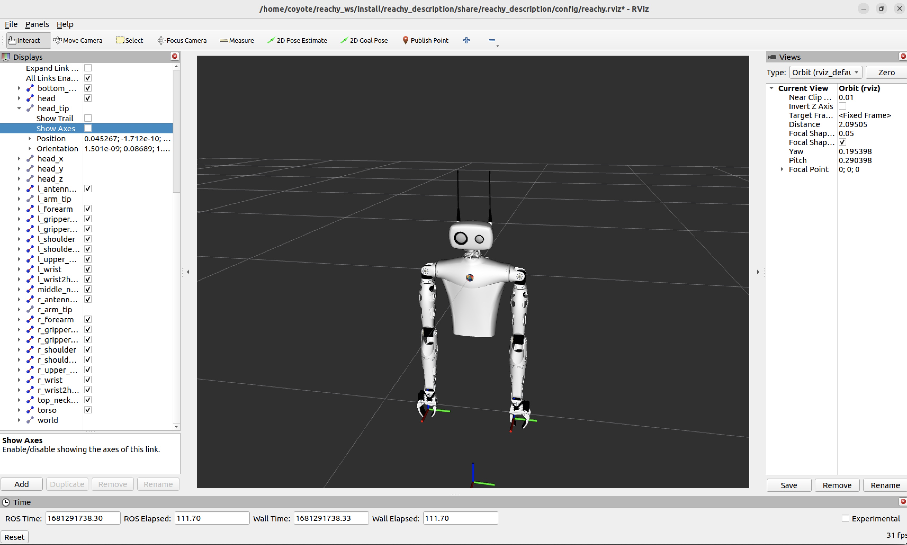

Even if [gRPC clients]() are available to control Reachy without knowing how to use ROS, you may want to work at the ROS level to implement new things for Reachy or use the tools provided by ROS. In this page, we will describe how to use the specfic ROS2 packages for Reachy.

Reachy runs natively on [ROS2 Humble](https://docs.ros.org/en/humble/index.html). ROS stands for Robotic Operating System, it offers a huge variety of compatible algorithms and hardware drivers.

<p align="center">
  
</p>

The embedded NUC computer comes with ROS2 and Reachy specific packages already installed and running. They provide full access to Reachy. You can:
- get the */joint_states* and */dynamic_joint_states*
- use *Rviz* to visualize your robot (either real or simulated)
- subscribe to various sensor topic (camera, force sensor, etc)
- publish position, torque, pid, etc commands using forward controller
- access client for IK/FK




> NOTE: If you don't know how to use ROS but still want to do it on Reachy, you should check the [official ROS documentation](https://docs.ros.org/en/humble/index.html), espcecially the [tutorials](https://docs.ros.org/en/humble/Tutorials.html) showing examples and presenting the different key notions introduced by ROS.

## What is runnning by default

If you have a **Full kit** or a **Starter kit**, `reachy_sdk_server.service` is enabled by default, meaninig that all Reachy ROS2 packages presented in the [Overall presentation]() are automatically launched when you start the robot.

If you have a **Reachy mobile**, `reachy_mobile_base.service` is enabled along with `reachy_sdk_server.service`. 

See section [Using services]() for more information on the services). 

You can check all ROS2 topics/services running on Reachy with:
```bash
ros2 topic list
```  
and 
```bash
ros2 service list
```

## Using launch files directly

The following presents what launch files can be launched, if you don't whant to use the service.
If you want to learn more about what is run by each launch file, check the README of the corresponding package.

## Bringup

This launch file is the main entry point. It is reponsible for launching everything you need to use your Reachy. It can either connect to a real Reachy or simulate a fake one. You can run the sdk server or not, etc.

To connect to your robot and run everything needed to control it via ROS you can simply run:

```ros2 launch reachy_bringup reachy.launch.py```

If you want to control it using the SDK:

```ros2 launch reachy_bringup reachy.launch.py start_sdk_server:=true```

Similarly, if you want to control a fake Reachy using the SDK, you can run (we also launch RViz so you can see what's going on):

```ros2 launch reachy_bringup fake:=true start_sdk_server:=true start_rviz:=true```

Other options are available and can be seen below:

```bash
ros2 launch reachy_bringup reachy.launch.py --show-args
Arguments (pass arguments as '<name>:=<value>'):

    'start_rviz':
        Start RViz2 automatically with this launch file. Valid choices are: ['true', 'false']
        (default: 'false')

    'fake':
        Start on fake_reachy mode with this launch file. Valid choices are: ['true', 'false']
        (default: 'false')

    'gazebo':
        Start a fake_hardware with gazebo as simulation tool. Valid choices are: ['true', 'false']
        (default: 'false')

    'start_sdk_server':
        Start sdk_server along with reachy nodes with this launch file. Valid choices are: ['true', 'false']
        (default: 'false')
```

This launch file actually runs many other launch files. If you want to have your custom launch file, the better way is probably to directly have a look at what's inside.

## Cameras nodes

*Cameras nodes are available for full/starter kit only:*  

To run the **camera view** node ROS services:
```bash
ros2 run camera_controllers camera_publisher
```
To launch the **camera zoom** node ROS services:
```bash
ros2 run camera_controllers camera_zoom_service
```
To launch the **camera focus** node ROS services:
```bash
ros2 run camera_controllers camera_focus
```

## Kinematics nodes

The Kinematics services are available to provide inverse and forward kinematics services for the arms, as well as inverse kinematics for the neck. They are launched automatically by the bringup launch file.

If you need to run them separately:

```bash
ros2 run reachy_kdl_kinematics reachy_kdl_kinematics
```

It requires the *robot_state_publisher* to be running.

## Mobile base

To launch the mobile base Hardware Abstraction Layer node:
```bash
ros2 launch zuuu_hal hal.launch.py
```
Many parameters on the mobile base like the maximum velocity can only be tuned at the ROS level. Check the [mobile base's HAL README](https://github.com/pollen-robotics/zuuu_hal) to learn about what you can do with the mobile base at the ROS level. 

## SDK server nodes

A layer above ROS, you can interact with **Reachy SDK API**. The Python SDK offers a gRPC (Remote Procedure Call) interface to communicate with the server.  
To communicate with Reachy through the SDK, you need to launch server nodes that handle gRPC services. The easier way is to use the special flag `start_sdk_server:=true` in the bringup launch file. But if you want to run it independently:

To launch the node for the **joints, fans and kinematics** gRPC services:
```bash
ros2 run reachy_sdk_server reachy_sdk_server
```

To launch the node for the **cameras view and zoom** gRPC services *(full/starter kit only)*:
```bash
ros2 run reachy_sdk_server camera_server
```

> Note: For the servers to work, the required ROS services must be already launched. The easier way is via the bringup launch file.


To launch the node for the **mobile base** gRPC services *(mobile kit only)*:
```bash
ros2 launch mobile_base_sdk_server mobile_base_sdk_server.launch.py
```