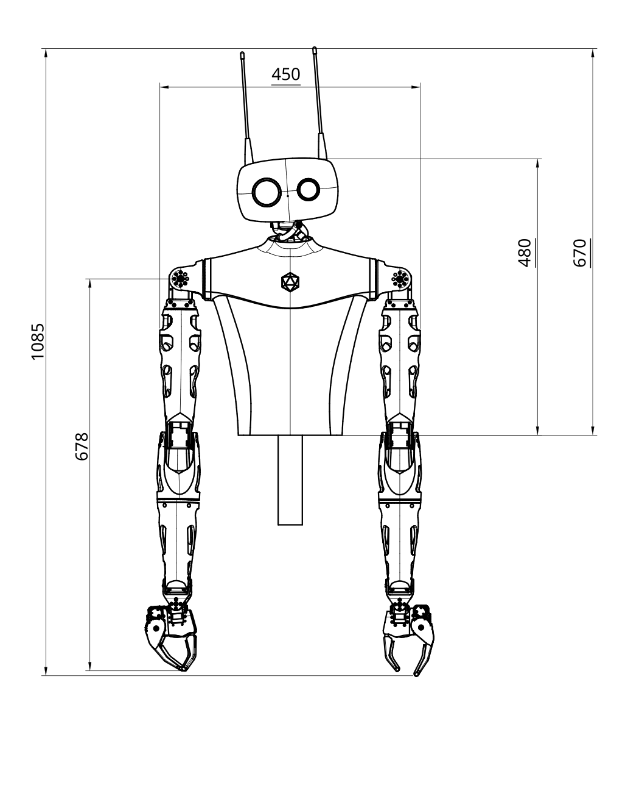

**Construction:** 3D printed MJF Painted - Flexible PU molded - Aluminium   
**Max Power consumption:** 180W   
**Full Kit Dimensions:** 670x450x200mm (670x1800x200mm with arms outstretched)   
**Starter Kit Dimensions:** 670x380x200mm (670x1008x200mm with arms outstretched)    
**Weight:** 6.2kg without metal fixation   

  

