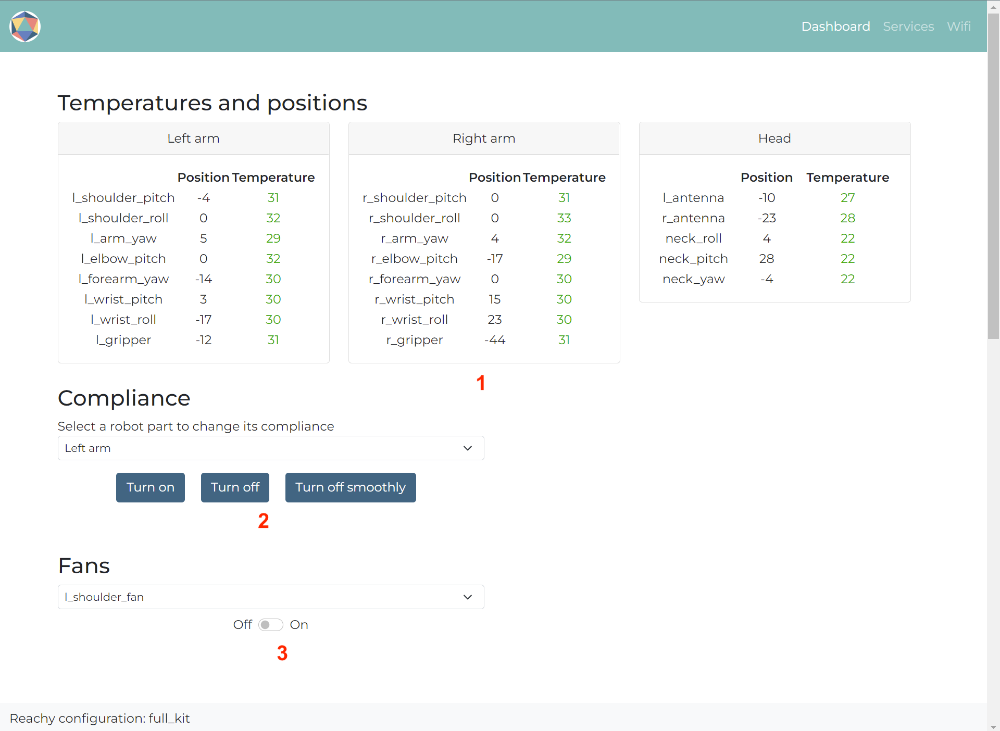

The dashboard page is only accessible if the tools in the [debug page]() found no missing motors or force sensors. It will allow you to get basic information from Reachy's motors, change their compliance and control Reachy's fans.

The page typically looks like the following:

  

It is composed of three parts:
1. Temperatures and positions displayer
2. Compliance controller
3. Fans controller

## Temperatures and positions displayer
The displayer is composed of one card per robot part (either Left Arm, Right Arm or Head).

For each card, the temperature (in Celsius) and position (in degrees) of each motor composing the part will be displayed in real time and refreshed every second. 

It is useful in cases where for example you want to check if the arms' joints are installed correctly or you are using Reachy and want to monitor the motors' temperatures.

For each motor, if the temperature is above 46°C, the temperature color will turn to red, indicating you that the motor starts to heat.

## Compliance controller
You can change the compliance of each robot's part easily with the compliance controller. For each part available in the dropdown, three compliance options are available:

* **Turn on**: put each motor composing the part in stiff mode,
* **Turn off**: put each motor composing the part in compliant mode,
* **Turn off smoothly**: first reduce the torque limit of each motor and then put each motor composing the part in compliant mode. This is the preferred method to put the the part in compliant, the risk of damaging a piece is greatly reduced.

More information on the compliance of the robot is available [here]().

## Fans controller
You can also turn on/off Reachy's fans. The fans are triggered automatically when a motor's temperature reaches 55°C but when you know you will be using the robot for a bit of time, it might be useful to turn them on sooner.
