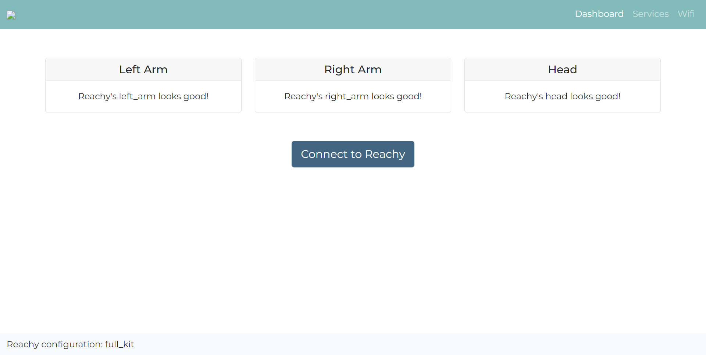
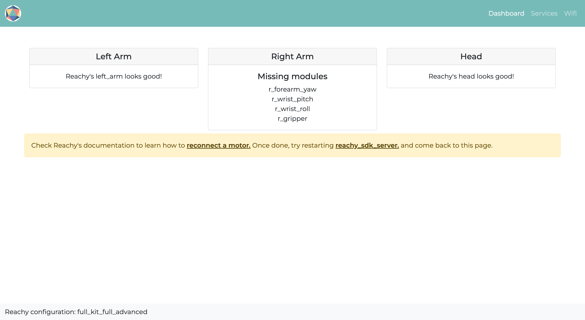
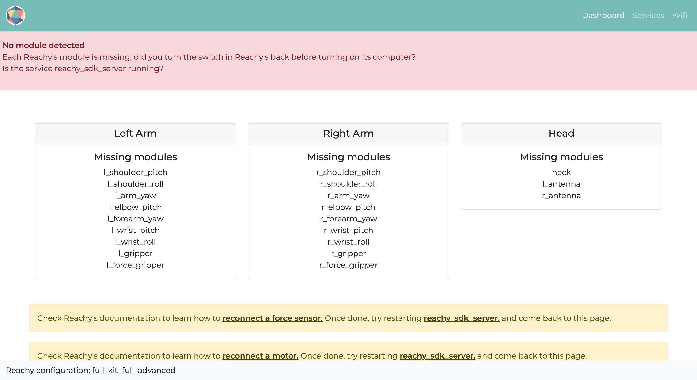

The debug page is the dashboard's home page. It will indicate you if one of Reachy's motor or force sensor is disconnected or if you forgot to turn on Reachy's motors before booting its computer. Using this page is a good first step in debug if you are not able to connect to Reachy using the [Python SDK]() or the [VR]() for example.

## Content

In this page, one card will be created per Reachy's part. We consider that each Reachy's arm represent a part and that the head is another part. So for example if you have a Full Kit Reachy, your robot will be composed of three parts: Left Arm, Right Arm and Head. If you are working with a Starter Kit Right Reachy, your robot will be composed of two parts: Right Arm and Head.

A debug page for a Full Kit Reachy will typically look like this:

  

The content of each card is what will change depending on what is going on with your robot.

## Missing motors or force sensor
For each part, the system will check at boot or when [*reachy_sdk_server.service*]() (Reachy's main service) is started whether each motor or force sensor required by the part is detected. If a motor or a force sensor is not detected, it probably means that a cable is disconnected. The dashboard will tell you which motor or force sensor is faulty.

For example, we disconnected on the right arm the cable between the elbow pitch and the forearm yaw joints, here is what the dashboard is indicating:

  

As you can see, each motor after the elbow pitch joint is missing whereas only one cable was disconnected, this is because the motors are connected in serial in Reachy's arms, so disconnecting one motor will unpower the next ones in the arm chain.

### How to solve this

We made dedicated pages explaining how a motor cable or a foce sensor can be reconnected. The link to the page will appear on the page along with the name of the disconnected motor.

When multiple motors are indicated as missing, try to look first around the first one in the list to check if a cable is disconnected.

## When each module is missing
The page might tell you that each motor and force sensor in Reachy is missing, like the following:

  

If this happens, it is probably because you forgot to turn Reachy's motors on before booting its computer or because [*reachy_sdk_server.service*]() is not started.

If it is because the motors were not turned on before Reachy's computer, just use the switch in Reachy's back to turn them on and then go to [the service page]() to restart reachy_sdk_server.service.

## If everything looks good

If no module is missing, then a button "Connect to Reachy" should be available as below. 

  

Pressing this button will redirect you to the [dashboard page]() where you will be able to monitor the motors temperatures and positions, control the fans or the joints compliance. More details on the [dashboard page]().

> If eveything looks good and you are still not able to connect to Reachy correctly, don't hesitate to check the [Help]() section of the documentation.

## Notes
* :warning: The detection is only performed by the system when the motors are turned on using the switch in Reachy's back. Thus if a cable is disconnected during manipulation, the dashboard will not be able to detect it. If you are not able to connect to Reachy and the debug page still tells you that each Reachy's part looks good, turning off and on Reachy's motors might be worth a shot.

* :warning: The detection of the missing motors and force sensors only works if Reachy's code is launched using [*reachy_sdk_server.service*]() in --user mode (default behavior). For the ROS users, if you work directly with the launch file, the page will tell you that every motor and force sensor is missing.