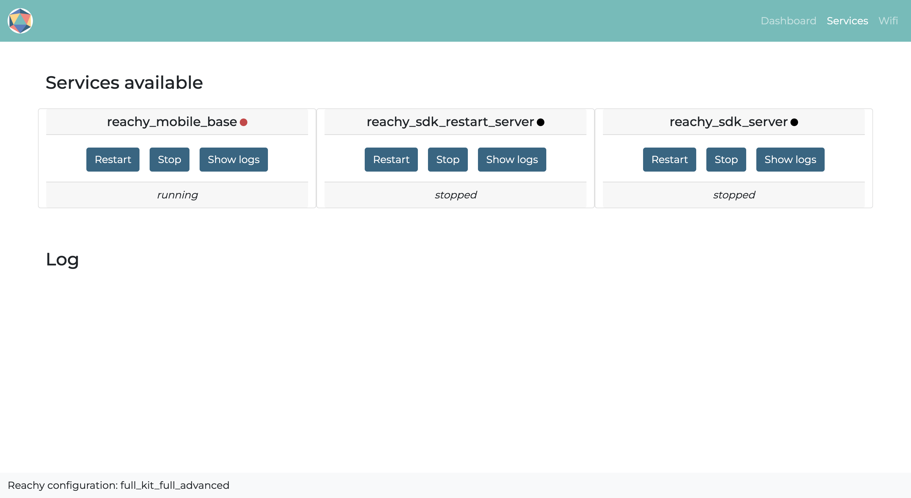

The page services is dedicated to the services set up for Reachy. Working with services has the advantage of having Reachy's code running automatically at boot whithout needing to open a terminal and start it yourself. However using the services can make debugging the robot more difficult because the code running for Reachy is "hidden", that is why we made this page.

Having this page is useful when something is going wrong with Reachy. For example, if you went on the [debug page]() and you were told that a motor was disconnected, you can reconnect the motor indicated and restart Reachy's code using the button restart of reachy_sdk_server.service. This way you won't have to reboot Reachy's computer just to restart its code. Or if you forgot to turn on Reachy's motors before booting, you can just restart the service.

## Content

In this page, one card will be created per Reachy's service. Typically the page will looks like the following:

  

For each service, it will be indicated whether the service is currently running or not and three buttons will be available:
* **Restart**: restarts the service,
* **Stop**: stops the service,
* **Show logs**: displays the logs of the service. Having the logs is useful for debugging, you will be able to see the error messages on what is causing the problem as if you were launching Reachy's code in a terminal.

## Notes
:bulb: Only services whose names start with *reachy_* and in --user mode will be displayed on the page.

For more information on how to handle the Reachy's services and what they are used for, check the [services page]().