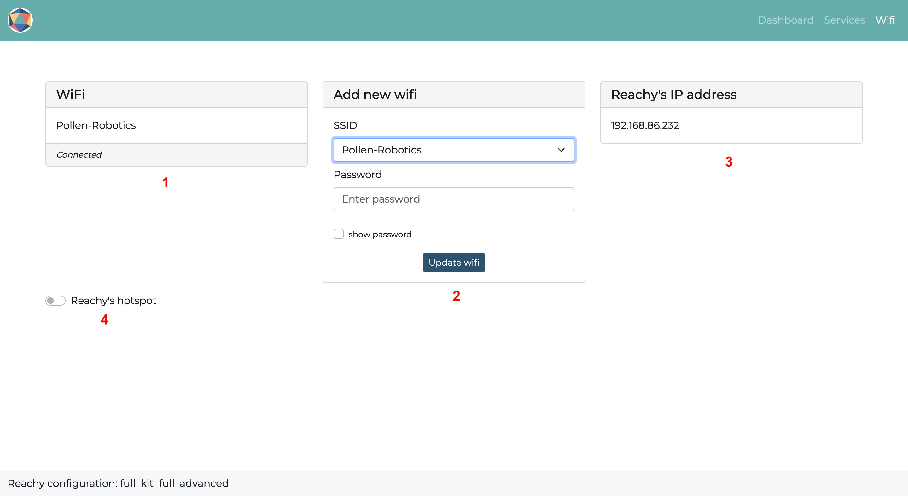
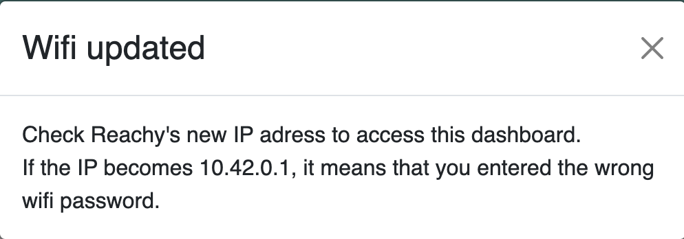

The wifi page of the dashboard lets you handle the network connection of the robot and typically looks like the following:

  

There are four main elements on this page:
1. **Connection card**: this card will display whether Reachy is connected to the Internet with an ethernet cable or a wifi network (in which case it will tell you which wifi network) or if it is using its hotspot,

2. **Wifi adder card**: this card will help you connect Reachy to a wifi network. The dropdown will list each wifi network detected and you will be able to connect to the one you want by entering your wifi password in the corresponding box,

3. **Reachy's IP address card**: this card will display Reachy's IP address. If Reachy's hotspot is activated, its IP address is fixed and is *10.42.0.1*,

4. **Hotspot toggle**: this will allow you to turn on/off Reachy's hotspot.

## Reachy's Hotspot
Reachy is able to emit its own wifi when needed. By default the hotspot is turned on when the dashboard is started and no wifi networks are known. This is the case when you first receive your Reachy for example. Having a hotspot is useful because it gives you the possibility to connect remotely to Reachy even when no wifi network is available.

When the hotspot is on, Reachy will emit its wifi under the network name ***Reachy-AP***. The password to connect to it is the same as the network name, ***Reachy-AP*** (mind the capital letter, the password is case sensitive).

When the hotspot is on, Reachy always has the same IP address on the network: ***10.42.0.1***.

## Changing wifi network
You can connect Reachy to a wifi network using the Wifi adder card. 

When you change the wifi network, the following message will appear:

  

If you try to change the wifi network and fail to enter the correct password, Reachy will switch to hotspot mode and you will have to try again to update the wifi network by connecting to *Reachy-AP*.

## Notes
:bulb: If you installed the dashboard yourself, you will need to forget previsouly known wireless networks on Reachy and only use the dashboard when handling wireless networks.

