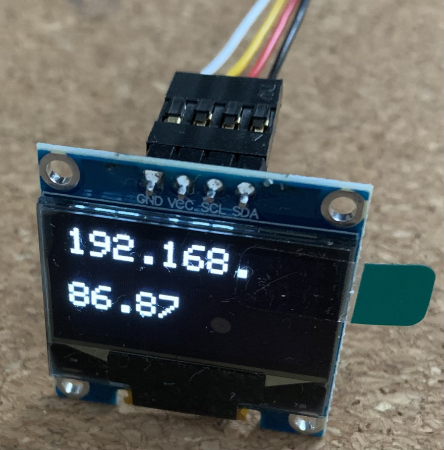

:bulb: **Note**: it is not mandatory to have the hardware, the dashboard will still work without it. This is just used to display the IP address of the robot on the network. It is useful when you want to connect to Reachy remotely without needing to plug a computer screen nor scanning the network to get its IP.

  

## Hardware

To display Reachy's IP address, four components are needed:
* [LCD display](https://www.amazon.fr/AZDelivery-pouces-Arduino-Raspberry-microcontrôleur/dp/B01L9GC470/ref=sr_1_3?dchild=1&keywords=Adafruit%2Bgrayscale&qid=1626104484&sr=8-3&th=1)
* [Arduino Nano Every](https://docs.arduino.cc/hardware/nano-every)
* cables to solder between the LCD and the Arduino
* a micro USB cable to connect the Arduino to Reachy's NUC.

## Flashing the Arduino

The code for the Arduino can be found [here](https://github.com/pollen-robotics/RAP-2021/blob/main/arduino/serial_communication.ino). Basically, it just listens to messages containing the IP address coming from Reachy's NUC on the serial bus, recovers the IP and displays it on the LCD screen.

The [Arduino IDE](https://docs.arduino.cc/software/ide-v2) will be needed to flash the Arduino.

## Wiring
* GND pin of the LCD display goes with GND pin of the Arduino
* VCC pin of the LCD display goes with 5V pin of the Arduino
* SCL pin of the LCD display goes with A5 pin of the Arduino
* SDA pin of the LCD display goes with A4 pin of the Arduino

## Install on Reachy
TODO