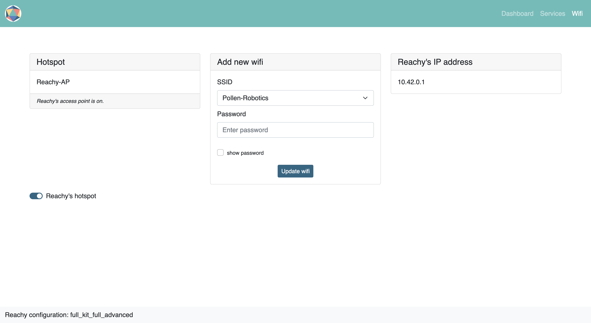

When you receive your Reachy, it can be quite confusing at first to get your hands on, that is where the dashboard comes handy.

The dashboard will allow you to setup your robot easily, without needing to plug a computer screen, mouse and keyboard.

## Reachy's hotspot

When Reachy does not know any wifi network at boot, [its hotspot]() is activated by default, meaning Reachy emits its own wifi. By default, the name of Reachy's hotspot is *Reachy-AP*. You can connect to the hotspot with your laptop or computer just like with any wireless network.

> Default password to connect to *Reachy-AP*: **Reachy-AP**  

When using its hotspot, Reachy's IP address is always the same, meaning that if you want to ssh to the robot or use the [teleoperation](), you won't have to search for Reachy's IP address.

> Default Reachy's IP address when in hotspot mode: **10.42.0.1**

## Connect Reachy to your wifi network

Once connected to the hotspot, you can easily access Reachy's dashboard and connect the robot to your wifi. To do that:
* [Turn the robot on]()
* With your phone or computer, connect to the wifi network *Reachy-AP* (password is *Reachy-AP*)
* With the device connected, goto the page <a href="http://10.42.0.1:3972/wifi">http://10.42.0.1:3972/wifi</a>

The page should look like this:

  

Then
* Select the wifi network you want Reachy to connect to. The wifi networks available should be in the dropdown under SSID.
* Enter your wifi password. If you need, you can use the *reveal password* option. If the password is correct, the hotspot will be turned off and Reachy will be connected to your network.   
If you entered an incorrect password, the hotspot will be turned on again, giving you the opportunity to try the connection again.

Then to access the dashboard on the newly connected network, you will need Reachy's new IP address. There are two ways to get that:
* read the IP on the LCD screen placed in Reachy's shirt, if it is installed.
* find Reachy's IP using an other tool, as explained in [this page]().

> To access the dashboard from your network, go to: http://\<your-reachy-ip\>:3972

In the next sections, you will learn the content of each page composing the dashboard.