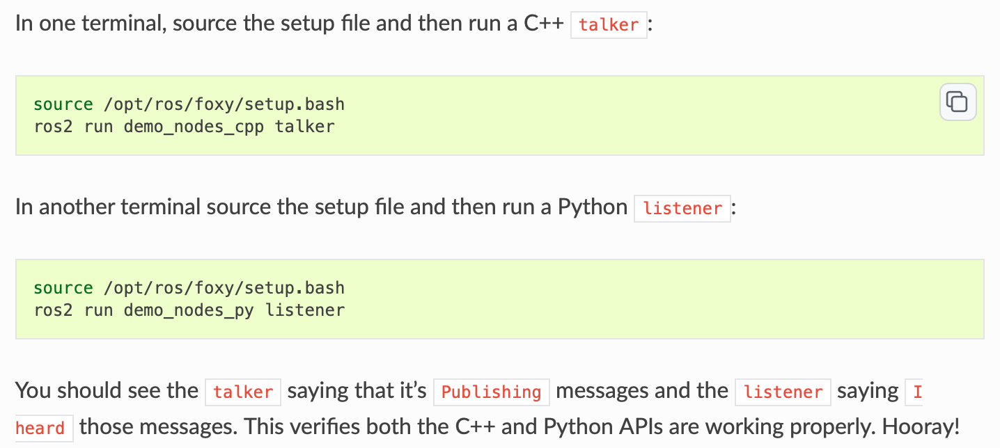
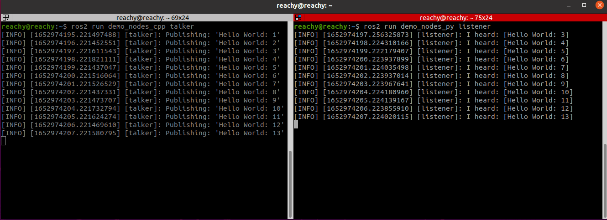
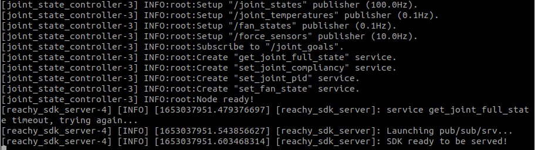
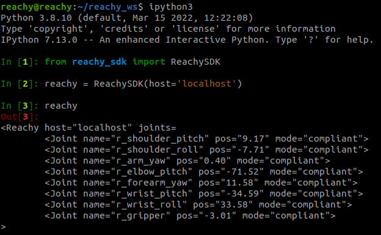

You decided to buy an **Arm kit**, you have a few things to install on your computer.
Don’t worry, we will go step by step to guide you through the installation process!

## Prerequisites
The low-level software used to control the robot has been developed to work on **Linux Ubuntu 20.04**. While it should work on other OS, we strongly recommend using the same version.  

## Presentation
Reachy's software installation is divided into two main parts:
- installing ROS2 Foxy and the ROS2 packages developped for Reachy
- installing the Python packages developped for Reachy

If you are not familiar with [ROS](https://www.ros.org), it stands for Robotics Operating System and is basically a set of software libraries and tools that help build robot applications. It is commonly used in Robotics. You don't need to know how to use ROS to work with Reachy thanks to the [Python SDK](https://github.com/pollen-robotics/reachy-sdk) that we developped but if you want to learn about ROS, we suggest taking a look at their great [tutorials](https://docs.ros.org/en/foxy/Tutorials.html).

Also, you can check [this page]() to know more about how Reachy's software is organised.

Now back to the installation!

## Install ROS2 Foxy
As explained above, Reachy's software runs on **ROS 2 Foxy** so first of all, you need to install it on your computer. 
Based on the [official ROS2 documentation](https://index.ros.org/doc/ros2/Installation/Foxy/Linux-Install-Debians/), here are the steps to do the installation.
In a terminal, in your computer:
```bash
sudo apt update && sudo apt install curl gnupg2 lsb-release
sudo curl -sSL https://raw.githubusercontent.com/ros/rosdistro/master/ros.key  -o /usr/share/keyrings/ros-archive-keyring.gpg
echo "deb [arch=$(dpkg --print-architecture) signed-by=/usr/share/keyrings/ros-archive-keyring.gpg] http://packages.ros.org/ros2/ubuntu $(lsb_release -cs) main" | sudo tee /etc/apt/sources.list.d/ros2.list > /dev/null
sudo apt update
sudo apt install ros-foxy-desktop

sudo apt install -y python3-argcomplete
sudo apt install python3-colcon-common-extensions
```
### Check that the installation went well
To make sure that ROS2 Foxy has been successfully installed, you can run the test example from ROS2 Foxy. 
Taken from the [ROS2 Foxy documentation](https://docs.ros.org/en/foxy/Installation/Ubuntu-Install-Debians.html#try-some-examples):

<p align="center">

</p>

Your two terminals should look like this:
<p align="center">

</p>

## Install Reachy's ROS2 packages
### Create a dedicated workspace
Now that you have installed ROS, you need to [create a ROS workspace](https://docs.ros.org/en/foxy/Tutorials/Workspace/Creating-A-Workspace.html) to install the specific ROS packages for Reachy.

Create it in your $HOME folder:
```bash
mkdir -p ~/reachy_ws/src
```

Build your empty workspace once to set everything up.
```bash
cd ~/reachy_ws
source /opt/ros/foxy/setup.bash
colcon build 
```

Once done, add commands to your *.bashrc* file so that you won't have to type them in each new terminal. 

```bash
echo "source /opt/ros/foxy/setup.bash" >> ~/.bashrc
echo "source /home/reachy/reachy_ws/install/setup.bash" >> ~/.bashrc
echo "source /usr/share/colcon_cd/function/colcon_cd.sh" >> ~/.bashrc
echo "export _colcon_cd_root=~/ros2_install" >> ~/.bashrc
```
In the seconde line, replace the *reachy* in */home/reachy/reachy_ws/install/setup.bash* with your username.

Finally, source your *.bashrc* file:
```bash
source ~/.bashrc
```

### Clone Reachy's ROS2 packages
Now you're ready to install Reachy's ROS2 packages in the workspace you just created.
The packages are the following:
* [reachy_msgs](https://github.com/pollen-robotics/reachy_msgs)  
* [reachy_controllers](https://github.com/pollen-robotics/reachy_controllers)  
* [reachy_kinematics](https://github.com/pollen-robotics/reachy_kinematics)   
* [reachy_sdk_server](https://github.com/pollen-robotics/reachy_sdk_server)

```bash
cd ~/reachy_ws/src
git clone https://github.com/pollen-robotics/reachy_msgs.git
git clone https://github.com/pollen-robotics/reachy_controllers.git
git clone https://github.com/pollen-robotics/reachy_kinematics.git
git clone https://github.com/pollen-robotics/reachy_sdk_server.git
```

Once everything cloned in your ROS2 workspace, build the packages:
```bash
cd ~/reachy_ws
colcon build
```

## Install Reachy's Python packages

***We recommend working in a [virtual environment](https://virtualenvwrapper.readthedocs.io/en/latest/) to install Reachy's Python packages.***

### Dependencies
Some of Reachy's Python packages have dependencies that you should install. The dependencies are *numpy, scipy, pyquaternion, sklearn, pykdl*.
* Using pip install:
```bash
pip3 install numpy
pip3 install scipy
pip3 install pyquaternion
pip3 install sklearn
```
* Using apt install:
```bash
sudo apt install python3-pykdl
```

We also recommend to install the *jupyter* and *matplotlib* libraries.
```bash
pip3 install jupyter
pip3 install matplotlib
```

### Cloning the Python packages
Create another folder *dev* that will contain all the packages used with Reachy that are not based on ROS.

```bash
mkdir ~/dev
```

In this folder you will need the following repositories:  

* [reachy_pyluos_hal](https://github.com/pollen-robotics/reachy_pyluos_hal)  
* [reachy_sdk_api](https://github.com/pollen-robotics/reachy-sdk-api)  
* [reachy-sdk](https://github.com/pollen-robotics/reachy-sdk)  

```bash
cd ~/dev
git clone https://github.com/pollen-robotics/reachy_pyluos_hal.git
git clone https://github.com/pollen-robotics/reachy-sdk-api.git
git clone https://github.com/pollen-robotics/reachy-sdk.git
```

Install the packages after the cloning.
```bash
cd ~/dev/reachy_pyluos_hal
pip3 install -e .

cd ~/dev/reachy-sdk-api
pip3 install -e python

cd ~/dev/reachy-sdk
pip3 install -e .
```

***To learn more on the repositories content and usage, please refer to README.md files in each repository.***

## Other
### Open ports for serial use
By default, on a Ubuntu install, when using serial, users do not have the right to access the ports. Give rights to open `/dev/ttyUSB` ports:
```bash
sudo usermod -a -G tty <usr_name>
sudo usermod -a -G dialout <usr_name>
```
### Set the correct configuration file
As Reachy software is meant to work with different robot configurations. Several configuration files are available.  

By default, the configuration is set to a **full robot**. You need to modify it to your own configuration.  

Open .bashrc: 
```bash
nano ~/.bashrc
```

And add an environment variable REACHY_MODEL that designates your model.  
For example, to configure only a right arm:
```bash
export REACHY_MODEL="robotic_arm_right"
```

Make sure to source your *.bashrc* file to take the modification into account:
```bash
source ~/.bashrc
```

### Generate a system.d file for auto-startup
If you want that all Reachy's ROS2 packages start automatically when your computer starts, you can use our systemd file:
```bash
cd ~/reachy_ws/src/reachy_sdk_server
bash generate-service-file.bash
```
This command should have created a file called *reachy_sdk_server.service*. To activate this service, you need to copy it to `systemd`:
```bash
sudo cp reachy_sdk_server.service /etc/systemd/system
```

Enable it for the service to be launched automatically when you restart your computer:
```bash
sudo systemctl enable reachy_sdk_server.service
```
You can manually start it doing:
```bash
sudo systemctl start reachy_sdk_server.service
```
*Note:* You need to connect the arm to your computer before starting a service. If you enabled the service, connect your arm to your computer before turning it on.  

*For more information on the services, please refer to section [Using services]().*


## If you want to work directly at the ROS level

If you prefer using the ROS2 packages instead of the Python SDK, you can find launch files in each of our ROS packages to set them up.
In particular, you can run:  
```bash
ros2 launch reachy_kinematics kinematics.launch.py  
# (for description and kinematics)
```

```bash
ros2 launch reachy_controllers joint_state_controller.launch.py  
# (for joint_state, joint_goals, fans, sensors, etc.) 
```

If you want to use the SDK, we provide a specific launcher file that starts everything (including the above mentioned ROS packages) at once:  
```bash
ros2 launch reachy_sdk_server run_everything_no_head.launch.py
```

For more information, check the page [Working with ROS2 Foxy]()

## Final checking
Everything should now be installed on your computer to start working with Reachy! Let's check this out.

First, if you created *reachy_sdk_server.service* to start everything in background, stop it.

```bash
sudo systemctl stop reachy_sdk_server.service
```

Then, launch the ROS2 packages in a terminal:
```bash
cd ~/reachy_ws/ros2 launch reachy_sdk_server run_everything_no_head.launch.py
```



The output in the terminal should look like this:
<p align="center">

</p>

Especially, you should see the line: ***SDK ready to be served!***.

Finally you can check that you can connect to the arm using Reachy's Python SDK.

In a python terminal:
```python
>>> from reachy_sdk import ReachySDK

>>> reachy = ReachySDK(host='localhost')

>>>reachy
```
For a robotic right arm, the outputs should look like this:
<p align="center">

</p>

If both of these are ok the arm's software installation should have went well!
