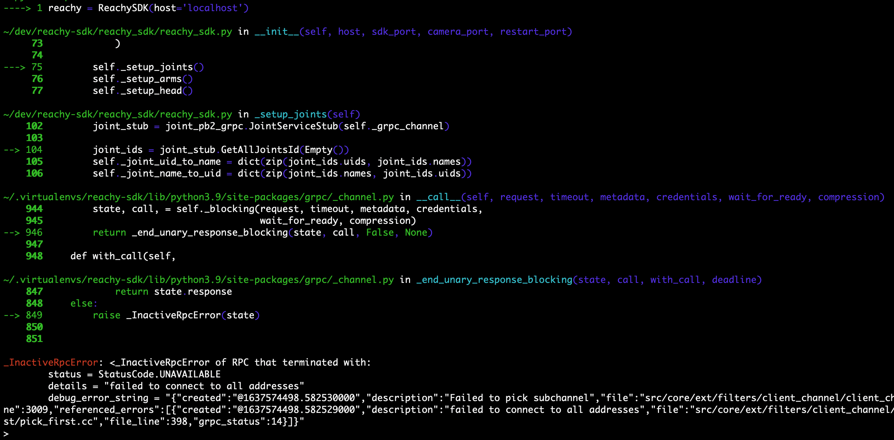
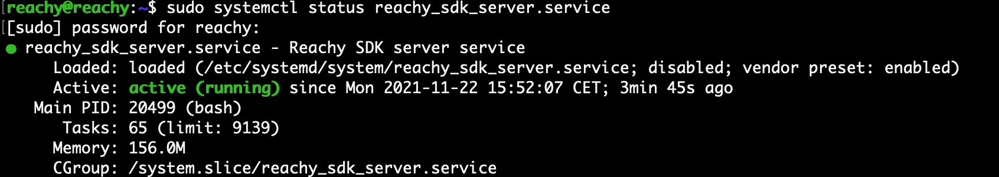
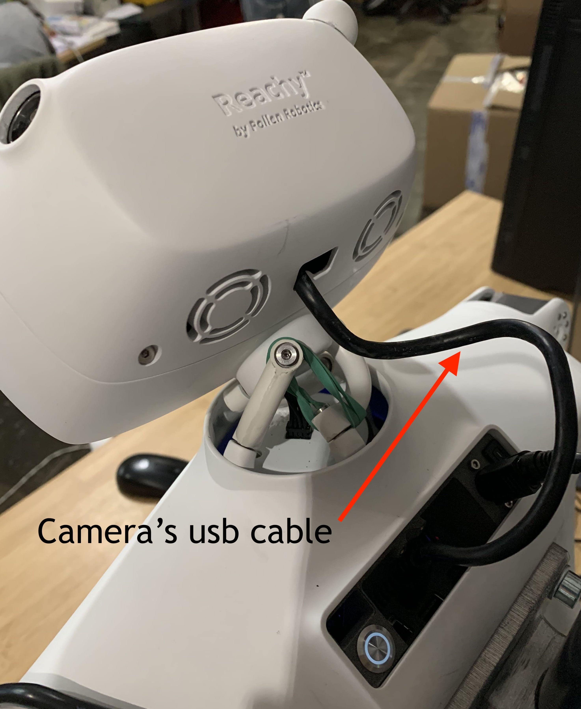

#### Problem with Python SDK

If you're using the [Python SDK](https://docs.pollen-robotics.com/sdk/getting-started/introduction/) you may encounter the following error when trying to connect to Reachy.

<p align="center">
  
</p>

#### Problem with ROS2 control

If you're [working directly at the ROS level](https://docs.pollen-robotics.com/advanced/software/ros2-level/), you might encounter issues of non-existing topics or services. 

The list of topics should look like the following for a Full/Starter kit:

```bash
$ ros2 topic list
> /fan_states
/force_sensors
/joint_goals
/joint_states
/joint_temperatures
/left_image
/parameters_events
/right_image
/robot_description
/rosout
/tf
/tf_static
```

For an Arm kit, the list should be the same without */left_image* and */right_image*.




## Debugging the SDK server

### Verify the service status
*If you are using one of the system.d service only:*  
  


Open a terminal on the computer, and enter:
```bash
sudo systemctl status <name_of_the_service>.service
```

The service should indicate ⬤ active (running) as shown below.

<p align="center">
  
</p>

If the service is not active, enable it and start it.
```bash
sudo systemctl enable <name_of_the_service>.service
sudo systemctl start <name_of_the_service>.service
```
Get [more information on Reachy system.d services here](https://docs.pollen-robotics.com/advanced/services/available)

### Checking list

If the service was actually running and the problems still persist, here is a list of things you can look at.

#### Motors off

This is something we often forget, especially during the first uses of Reachy: turning Reachy's motors on using the power switch in Reachy's back before turning on Reachy's computer.

Respecting this order of ignition is needed for the sdk server to start correctly.

#### Reachy's computer is off
If you work only remotely on Reachy, you may have forgotten to turn Reachy's computer on using the round button in the back. A round white led around the button should be on when the computer is on.
    
If you're having trouble turning on Reachy's computer, you can check the page on [why Reachy's computer is not running]().

#### Using an incorrect IP address
If you work on Reachy remotely, you might have entered the wrong IP address when you were trying to connect to the robot using *ReachySDK(host='Reachy IP address').* Check the section on how to [find Reachy's IP address](http://docs.pollen-robotics.com/help/system/find-my-ip/).

#### One motor is disconnected
The cable of one of Reachy's motor might be disconnected. To check that, you can use the [discovery tool]() to check if all the motors are detected.

If one motor is disconnected, check the page on [How to reconnect a motor]().

#### Force sensor not detected
Reachy is equipped with a force sensor in each gripper connected to Reachy's computer by an eight wires cable which may have been disconnected during manipulation or transportation. The [discovery tool]() can also indicate if Reachy's software detects the force sensors.
    
  If one force sensor is disconnected, check the page on [how to reconnect a load sensor]().
    

#### Camera opening failed
Sometimes, Reachy's cameras cannot be accessed correctly by Reachy's computer. With a computer screen connected to Reachy's back using an HDMI cable, you can check whether the camera reading is working or not.
    
A [python script](https://github.com/pollen-robotics/reachy_controllers/blob/master/examples/view_cam.py) is available to view the camera feed. In a terminal in Reachy's computer:

```bash
$ sudo systemctl stop reachy_sdk_server.service
$ python3 ~/reachy_ws/src/reachy_controllers/examples/view_cam.py left opencv
```

If a window opens with the camera feed: great, the left camera is correctly detected. You can press 'q' to exit the window.

Same for the right camera:

```bash
$ python3 ~/reachy_ws/src/reachy_controllers/examples/view_cam.py right opencv
```

If one (or both) of them is not working, you can check if the USB cable coming from Reachy's neck is correctly connected.

<p align="center">
  
</p>

If it was actually connected, usually restarting Reachy's computer does the trick.

### Checking if the problem is solved

If you think you were in one of situations above and you solved it, you can restart Reachy's server and try to reconnect to Reachy.

In a terminal:

```bash
$ sudo systemctl restart reachy_sdk_server.service
```

In a Python terminal:

```python
from reachy_sdk import ReachySDK

reachy = ReachySDK(host='localhost')
```

You should not have the *_InactiveRpcError* again after the second instruction if the server is working well.

## Nothing worked!

If none of the above worked, you can launch Reachy's server by hand. This is the best way to know what is wrong as it will print everything. However, there might be a lot of information so it can be quite hard to interpret.

```bash
$ sudo systemctl stop reachy_sdk_server.service
$ bash ~/reachy_ws/src/reachy_sdk_server/launch_all.bash
```

Don't hesitate to send the output of *launch_all.bash* on the support channel of [Pollen Community](https://discord.gg/Kg3mZHTKgs) on Discord, a team member of Pollen will help you debug it.