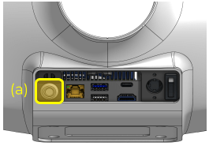

## Reachy's computer is off, even after pressing the on button

When you power your robot and turn on both the motors and Reachy's computer, you might have Reachy's computer still not turned on. 

There are two ways to check this:

- check Reachy's computer power button

  

If the computer is turned on, there should be a round white led around the button brighting.

- check if the computer fan is running

To do that, first lower Reachy's tee-shirt, on the front side you should see something like this:

  

The fan is the blue piece on the photo. If you can see the fan blades, it means that the computer is not running. If not, it probably means that the fan is running and it is just too fast for the blades to be seen.

So if you checked that Reachy's computer is off, even after pressing the on button, this probably means that the cable powering it is disconnected.

  

If it actually is, you should plug the cable back, according to the pin schematic shown in the photo above. This should solve the problem.

## Reachy's computer is on, but nothing is displayed

If you can see that Reachy's computer is running (either by seeing the round led in the button brighting or by checking if the computer's fan running) but still can't see any image with a computer screen plugged to the robot, it probably means that there is an issue with the hdmi connection.

First of all, check that that the computer screen is actually powered and that the hdmi cable is well plugged. A defective hdmi cable can also cause bad connections.

 



 

Sometimes, just restarting the computer solves the problem.