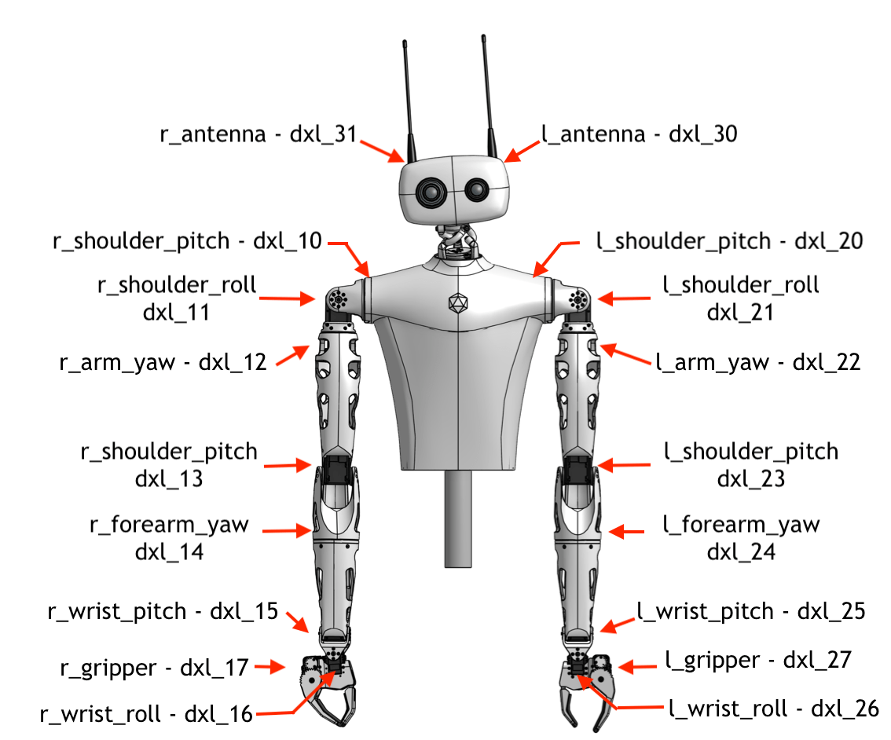

Reachy's SDK Server might not work due to a motor that have been disconnected during transportation or manipulation. Knowing which motors are actually detected by Reachy's software is really useful for debug.

## Stopping the running service

First of all, you need to stop the service running. If you have not modified the default service, open a terminal and enter:

```bash
systemctl --user stop reachy_sdk_server.service
```

## Running the discovery

Then you can run the discovery python script to detect the connected motors. 

**Make sure that the motors are turned on using the power switch in Reachy's back**.

```bash
cd ~/reachy_ws/src/reachy_2023/reachy_utils
python3 -m reachy_utils.discovery
```

This python script will look at each robot's part (e.g head / left arm / right arm for a Reachy full kit or head / right arm for a Reachy starter kit right) and tell which motors it sees. This is useful to check whether there are missing motors, **most likely due to a disconnected cable**.

For a Reachy full kit, the output typically looks like this:

```bash
TODO
```

## Analysing the discovery's output

### Motors

<p align="center">
  
</p>

Check the page on [How to reconnect a motor]() if you have any missing motors.

### Load sensor

There is one load sensor in each Reachy's arm, located between the gripper and wrist_roll motors. The id *'40'* is for the left arm's load sensor and the id *'50'* is for the one in the right arm.

If you don't see in the discovery a load sensor for each arm, it means that one of them is disconnected. In that case, you should look at the connection of the missing one. As for the motors, the absence of a load sensor in a discovery is most likely due to disconnected cable.

You can check the page on [how to reconnect a load sensor]() if you need.

### Orbita

The last element that you should see if you have a Reachy with an head is the Orbita joint of the necl. If you don't see it, it's likely that the cable is disconnected.

TODO: add up-to-date image

## Redoing a discovery

Doing a new discovery after each cable manipulation for missing motors or load sensors will allow you to check if the problem is solved.

## Restarting the service

Once you have all the motors and load sensors you need in the discovery, you can restart Reachy's software.

```bash
systemctl start --user reachy_sdk_server.service
```
