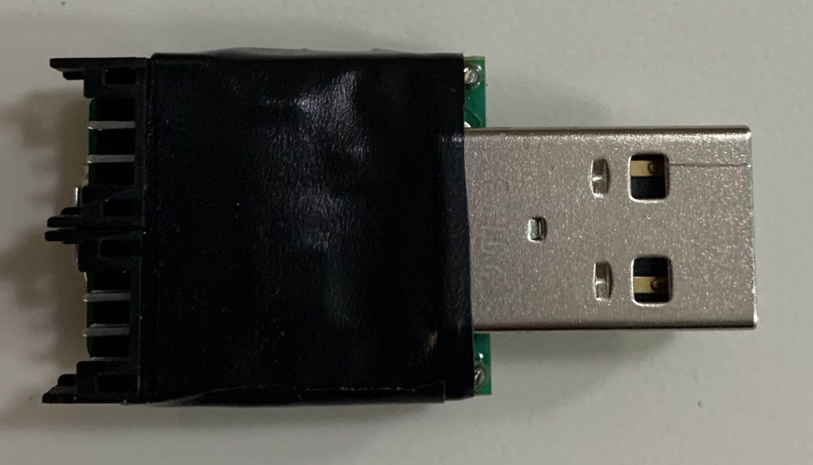
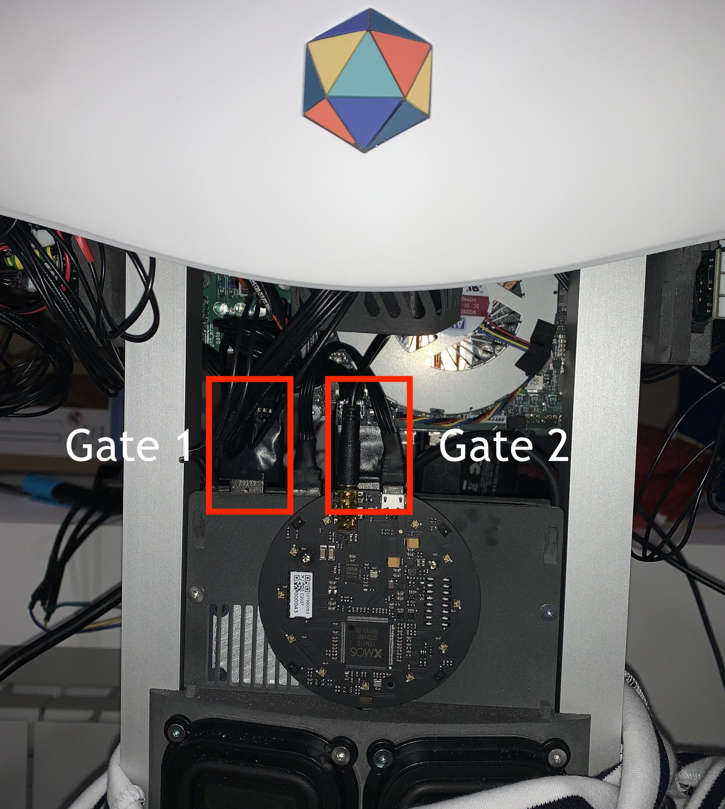
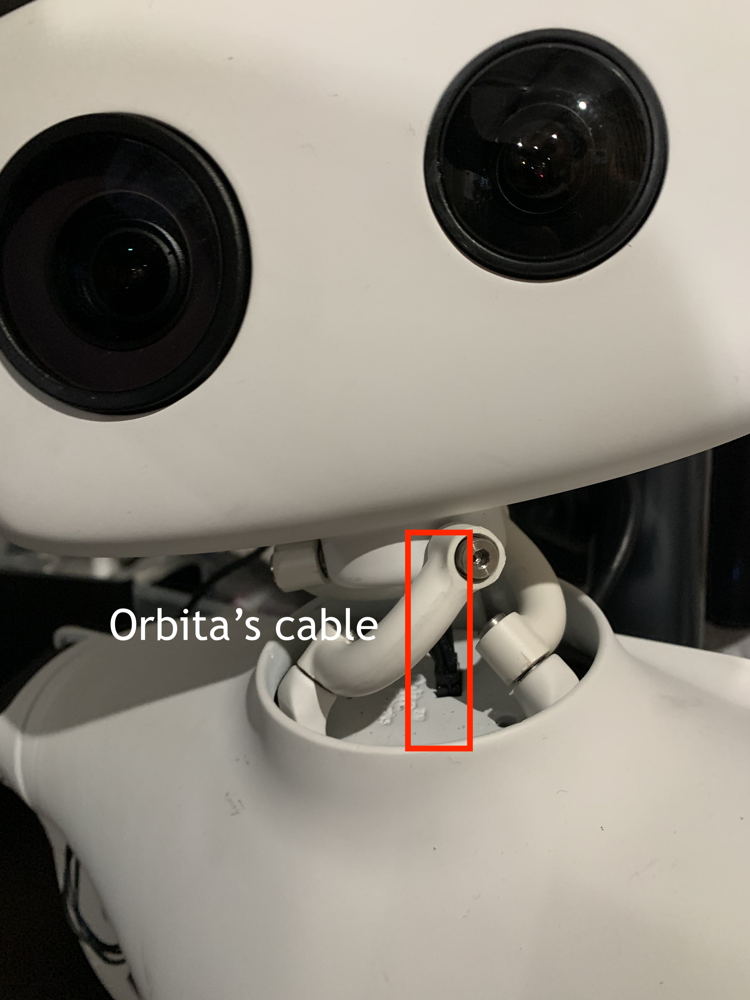

Reachy's SDK Server might not work due to a motor that have been disconnected during transportation or manipulation. Knowing which motors are actually detected by Reachy's software is really useful for debug.

## Stopping the running service

First of all, you need to stop the service running. If you have not modified the default service, open a terminal and enter:

```bash
sudo systemctl stop reachy_sdk_service.service
```

## Running the discovery

Then you can run the discovery python script to detect the connected motors. 

**Make sure that the motors are turned on using the power switch in Reachy's back**.

```bash
cd ~/dev/reachy_pyluos_hal
python3 -m reachy_pyluos_hal.discovery
```

This python script will look at each robot's part (e.g head / left arm / right arm for a Reachy full kit or head / right arm for a Reachy starter kit right) and tell which motors it sees. This is useful to check whether there are missing motors, **most likely due to a disconnected cable**.

For a Reachy full kit, the output typically looks like this:

```bash
/dev/ttyUSB2
{0: [LuosContainer(id=1, alias='gate', type='Gate')], 2: [LuosContainer(id=2, alias='dxl_30', type='DynamixelMotor'), LuosContainer(id=3, alias='dxl_31', type='DynamixelMotor')], 5: [LuosContainer(id=4, alias='orbita_40', type='ControllerMotor')]}

/dev/ttyUSB1
{0: [LuosContainer(id=1, alias='gate', type='Gate')], 2: [LuosContainer(id=2, alias='dxl_20', type='DynamixelMotor'), LuosContainer(id=3, alias='dxl_21', type='DynamixelMotor'), LuosContainer(id=4, alias='dxl_22', type='DynamixelMotor'), LuosContainer(id=5, alias='dxl_23', type='DynamixelMotor'), LuosContainer(id=6, alias='dxl_24', type='DynamixelMotor'), LuosContainer(id=7, alias='dxl_25', type='DynamixelMotor'), LuosContainer(id=8, alias='dxl_26', type='DynamixelMotor'), LuosContainer(id=9, alias='dxl_27', type='DynamixelMotor')], 11: [LuosContainer(id=10, alias='load_20', type='Load')]}

/dev/ttyUSB0
{0: [LuosContainer(id=1, alias='gate', type='Gate')], 2: [LuosContainer(id=2, alias='dxl_10', type='DynamixelMotor'), LuosContainer(id=3, alias='dxl_11', type='DynamixelMotor'), LuosContainer(id=4, alias='dxl_12', type='DynamixelMotor'), LuosContainer(id=5, alias='dxl_13', type='DynamixelMotor'), LuosContainer(id=6, alias='dxl_14', type='DynamixelMotor'), LuosContainer(id=7, alias='dxl_15', type='DynamixelMotor'), LuosContainer(id=8, alias='dxl_16', type='DynamixelMotor'), LuosContainer(id=9, alias='dxl_17', type='DynamixelMotor')], 11: [LuosContainer(id=10, alias='load_10', type='Load')]}
```

## Analysing the discovery's output

### Gates

Each part of Reachy is independent and communicate with Reachy's internal computer through a gate.

<p align="center">
  
</p>

There are three gates in a Reachy full kit version, one per arm located in the torso under its shirt and one in the head to communicate with Orbita and the antennas.

<p align="center">
  
</p>

Each gate is on a different USB port of Reachy's computer. That is why on the output above we get the object

```bash
0: [LuosContainer(id=1, alias='gate', type='Gate')]
```

three times. 

If when you run the discovery you get less */dev/ttyUSB* detected than Reachy's part in your robot, it means that one of the gate is disconnected or damaged. For a starter kit right for instance, two gates should be detected with a discovery, one for the right arm and one for the head, not less nor more.

### Motors

For each line, each LuosContainer of type *DynamixelMotor* corresponds to one of Reachy's motor. Each *DynamixelMotor* has an alias and the schematic below indicates the alias of each motor so that you can analyse the output and check if all the motors are actually detected. If not, you can check the wiring of the missing motors.

<p align="center">
  
</p>

Check the page on [How to reconnect a motor]() if you have any missing motors.

### Load sensor

Another *LuosContainer* object that you should see in the discovery output for each arm is for the load sensor.

```bash
LuosContainer(id=10, alias='load_20', type='Load')
```

There is one load sensor in each Reachy's arm, located between the gripper and wrist_roll motors. The alias *'load_20'* is for the left arm's load sensor and the alias *'load_10'* is for the one in the right arm.

If you don't see in the discovery a load sensor for each arm, it means that one of them is disconnected. In that case, you should look at the connection of the missing one. As for the motors, the absence of a load sensor in a discovery is most likely due to disconnected cable.

You can check the page on [how to reconnect a load sensor]() if you need.

### Orbita

The last *LuosContainer* that you should see if you have a Reachy with an head is the following :

```bash
LuosContainer(id=4, alias='orbita_40', type='ControllerMotor')
```

This is for the Orbita joint. If you don't see it, it's likely that the cable in the image below is disconnected.

<p align="center">
  
</p>

## Redoing a discovery

Doing a new discovery after each cable manipulation for missing motors or load sensors will allow you to check if the problem is solved.

## Restarting the service

Once you have all the motors and load sensors you need in the discovery, you can restart Reachy's software.

```bash
sudo systemctl start reachy_sdk_service.service
```
