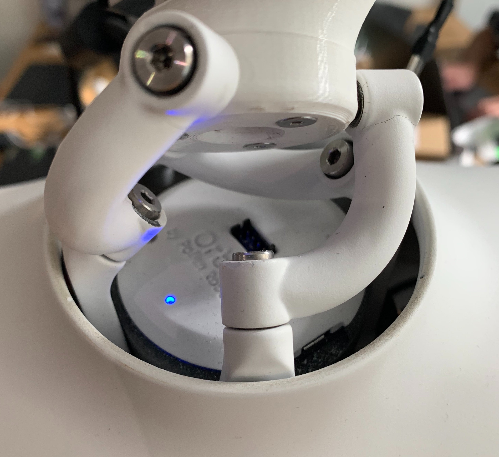

The Orbita actuator is equipped with a blue LED which gives information about its state.

<p align="center">
  
</p>

The LED can have three behaviors:

- the LED is off: Reachy's software is running,
- the LED is on and not blinking: Orbita's motors are turned on but Reachy's software is not started,
- the LED is blinking: it indicates an Orbita safety shutdown due to the motors overheat. This usually happens when the motor are forcing. For example, Orbita is asked to go to a position it cannot reach or the motors have been much solicited like when the head have been looking down for quite some time.
    
    When you encounter this issue, turn the motors off using the interruptor in Reachy's back, wait a bit for the motors to cool down and turn it on again. 
    
    You would have to restart the service for Reachy's software after that with the command:
    
    ```bash
    sudo systemctl restart reachy_sdk_server.service
    ```
    

## How can I know if Orbita's disks reached their limit and forced?

The limits for each disk are dependent of each other. So, unfortunately there is no simple way to know if you reached the limit. The best option is to check whether the motor reached the target position you set or not.

To know that, refer to [Reachy's SDK documentation](https://pollen-robotics.github.io/reachy-2021-docs/sdk/first-moves/head/).
