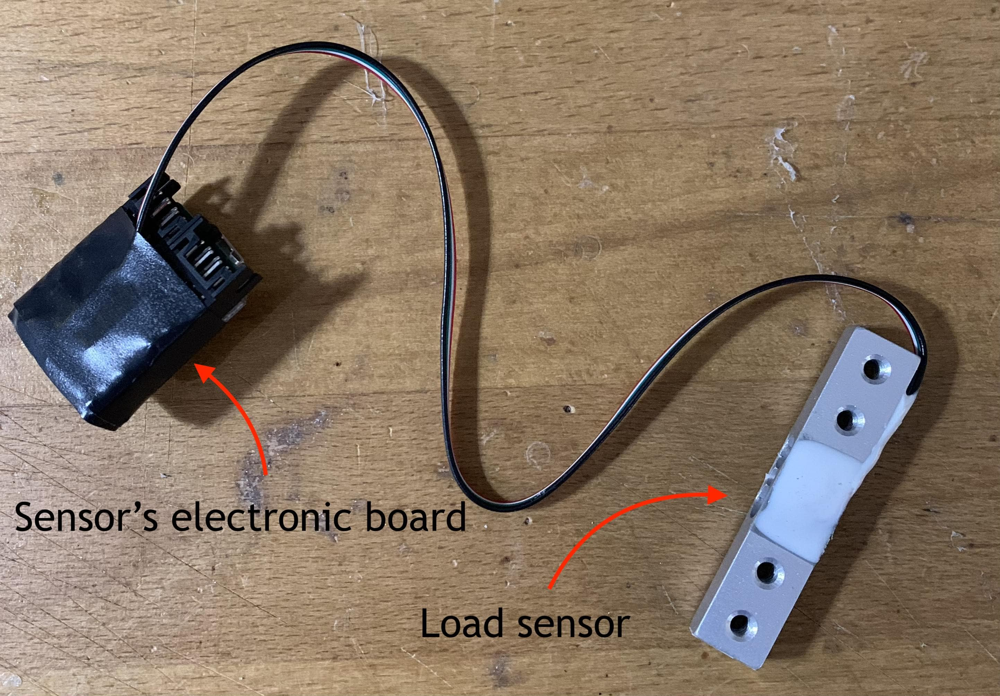
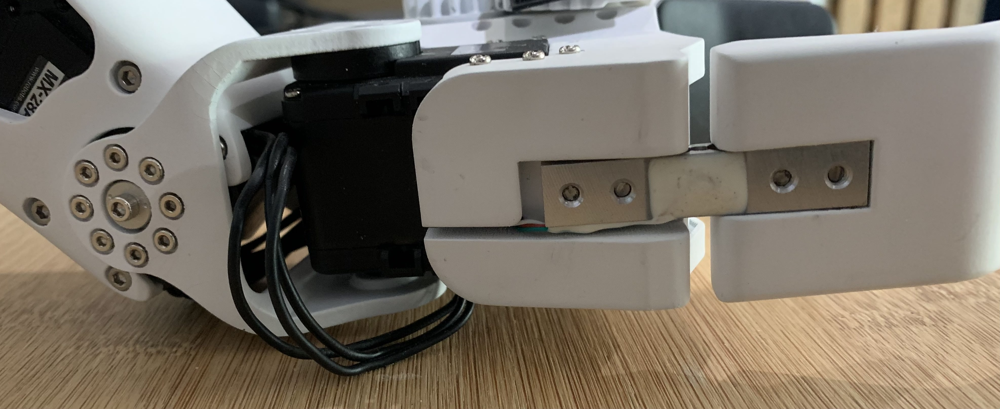
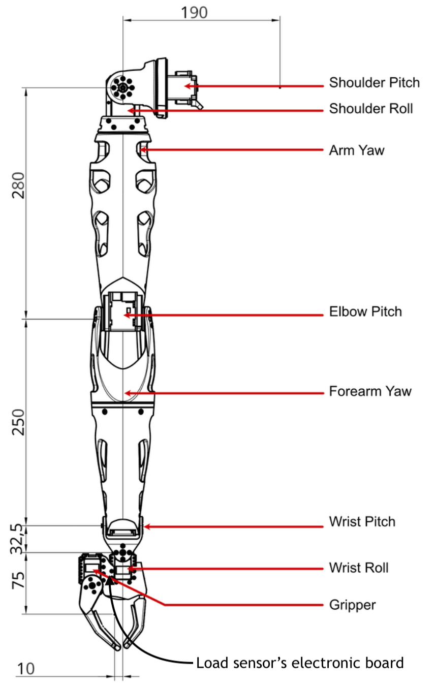
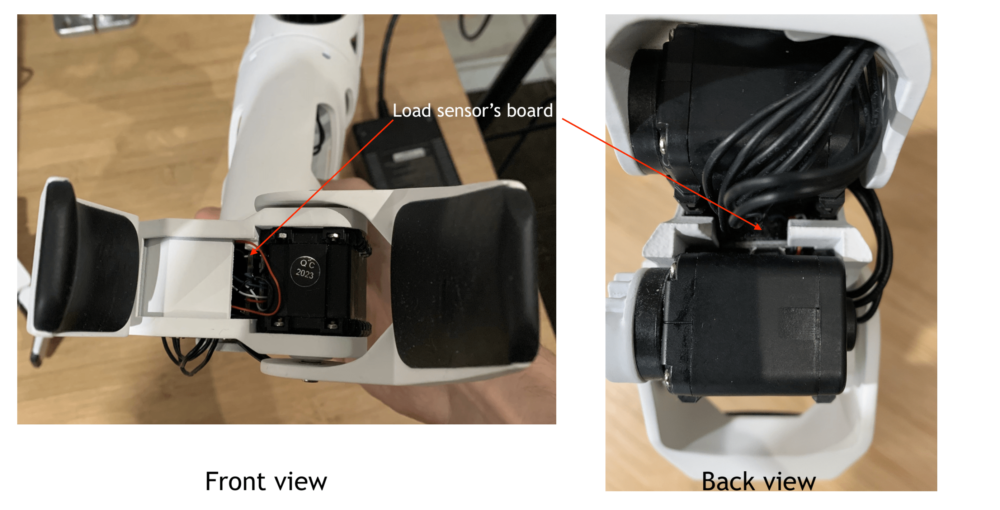
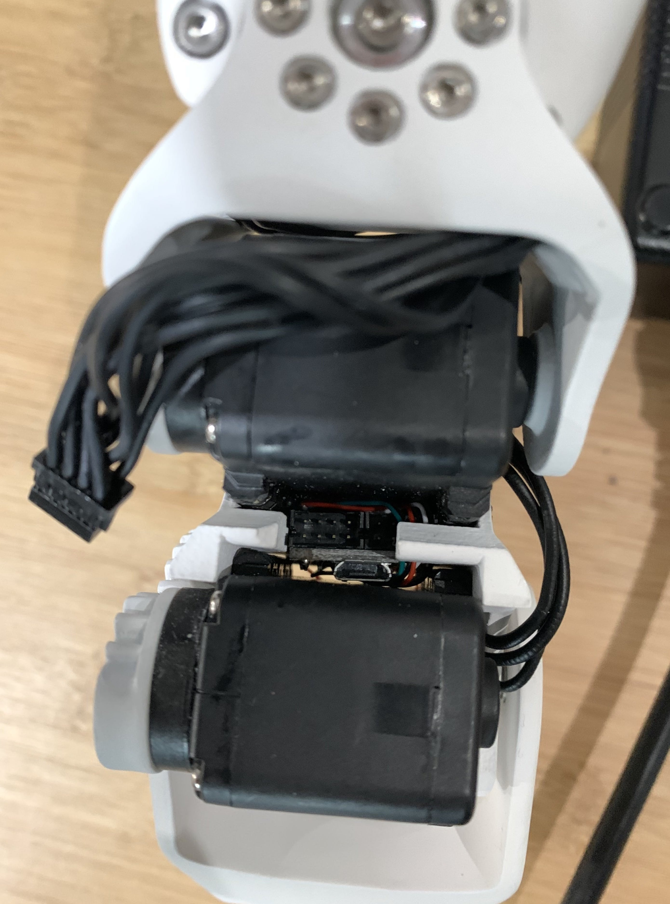
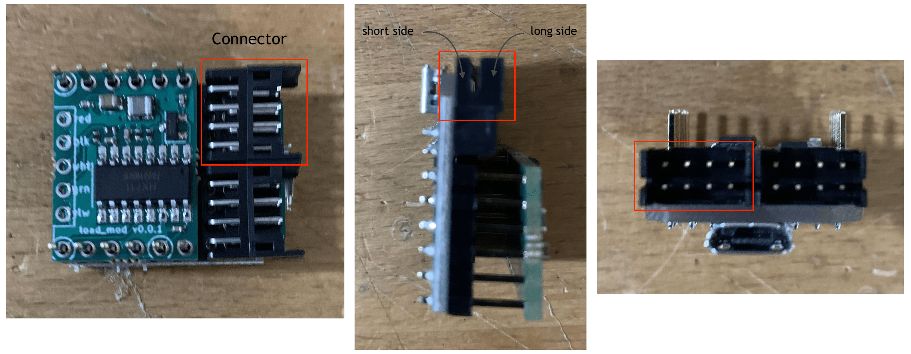

TODO: update

Each arm of Reachy is equipped with a load sensor to measure how much force is applied by the gripper to the object. It allows to know when the gripper is holding an object.

The load sensor is in two part: the sensor itself and an electronic board reading its values and connected to Reachy's internal computer.

  

The sensor is placed between the two 3D printed pieces composing Reachy's gripper.

  

The electronic board is placed between the gripper and wrist_roll motors of the arms.

  

  

The board is connected to Reachy's computer by a long 8 black wires cable plugged by the back.

When we refer in the documentations as the load sensor being disconnected, we refer to the cable between the board and Reachy's computer as disconnected. It's usually the case, the wires between the sensor and the board are rarely desoldered.

You can check an example of the disconnected cable below.

  

Be aware that there is a way for the connector. On the cable there is a short and a long side. 

  

