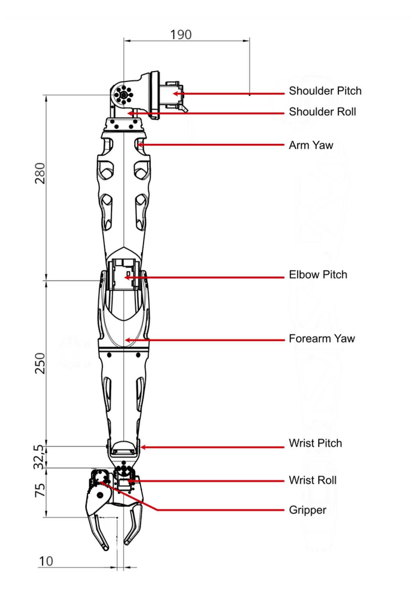
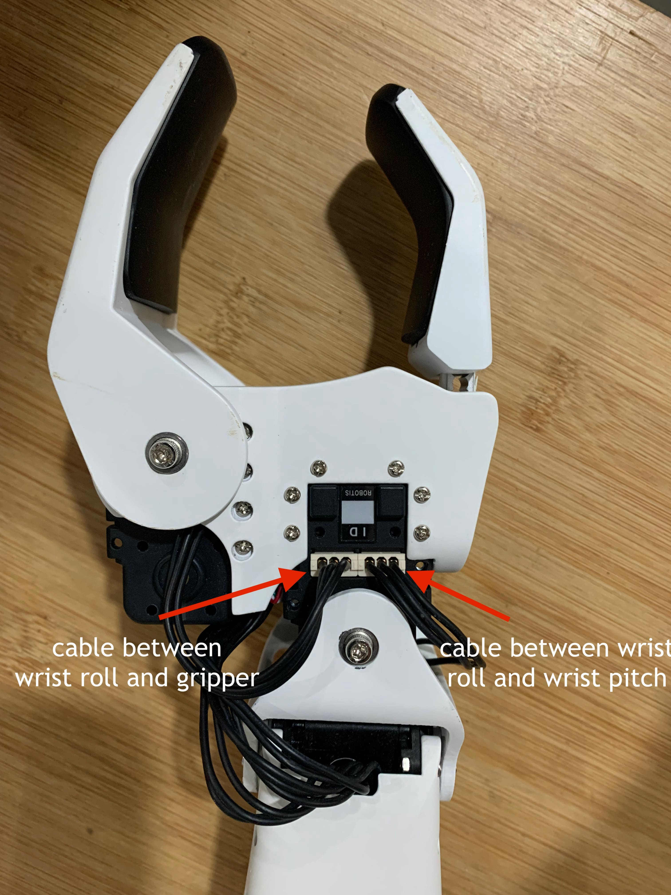
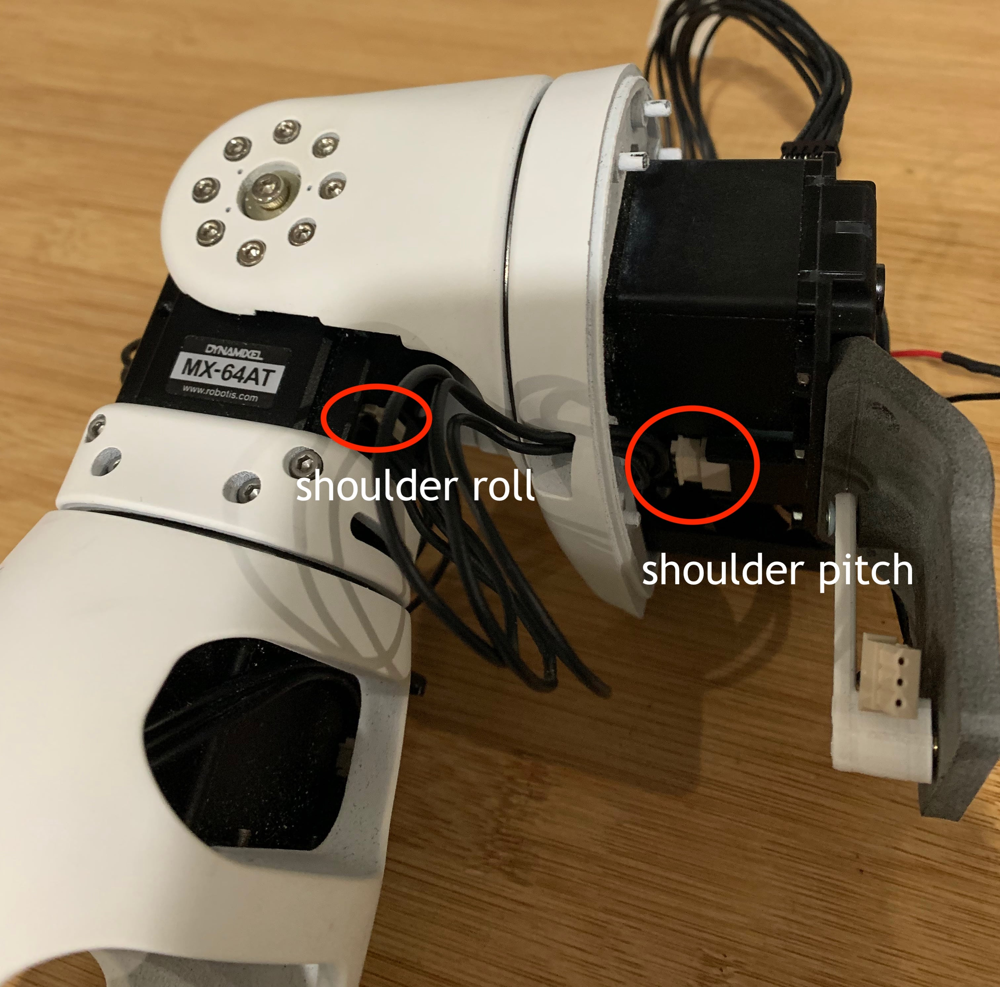
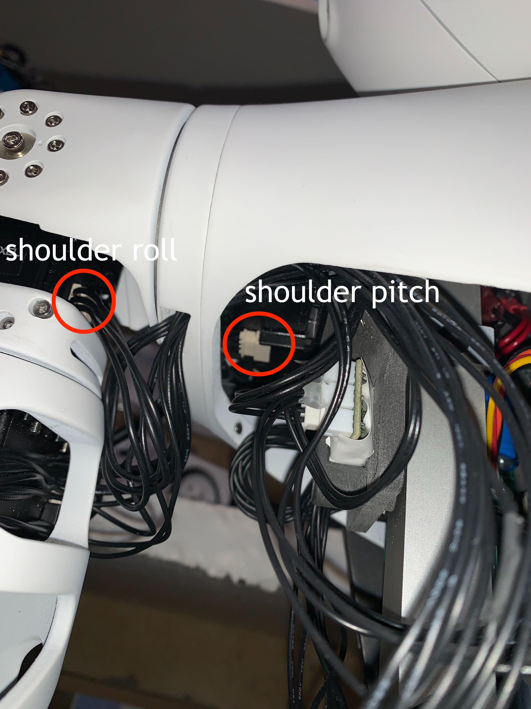

During manipulation or transportation, a motor cable of Reachy's arm might get disconnected.

An unplugged cable can be spotted more or less easily in each part of an arm, except for the shoulder pitch motor inside Reachy's torso which is a bit harder.

A typical arm of Reachy is composed of eight motors. The motors are connected as a chain starting with the shoulder pitch. Each motor is connected to the motors located before and after it in the chain.

  

For example in the photo below showing the back of Reachy's wrist, we can see that the wrist roll motor is connected to the wrist pitch motor and to the gripper.

  

## How can I know if a cable is disconnected?

If you can't connect to Reachy using its [Python SDK](https://docs.pollen-robotics.com/sdk/getting-started/introduction/) or the [VR Teleoperation app'](https://docs.pollen-robotics.com/vr/introduction/introduction/), there might be an issue of motor connection.

To check which motors are actually detected, use the [discovery tool](). It will tell you the motors that the system can see and you would be able to check the missing ones. If one motor is disconnected, the following motors in the arm's chain will not be detected. 

For example, if I disconnect the cable between the elbow pitch and the arm yaw motor, Reachy's software will only detect the shoulder pitch, shoulder roll and arm yaw motors in the arm's motors chain.

Thus with the information of the undetected motors you can check if there is any cable disconnected. Just a partial disconnection might be enough to make the motor undetected. You should start by checking the cables of the first missing motor in the chain and run the detection again.

If the motor detection tells you that it sees no motors, there might be just turned off.

## How can I reconnect a cable?

Once you spotted the disconnected cable, make sure that you **turn off the motors** using the interruptor in Reachy's back before starting the reconnection.

Reconnecting a cable should not require strength. If when manipulating you feel that you would need a lot of strength to make the connection between the cable end and the connector, this could be because the cable end and the connector are not well aligned or because the cable end is in the wrong way.

## The shoulder pitch cable

The most frequent cable, which is also a hard one to reconnect unfortunately, being disconnected is the cable between the shoulder pitch and the shoulder roll on the side of the shoulder pitch.

You can see the cable on this photo of an arm out of its torso.

  

Below is a view of the cable from a complete Reachy whose tee shirt has been put down.

  

We believe that having the images of where this cable is located exactly will help in case you would have to reconnect it.